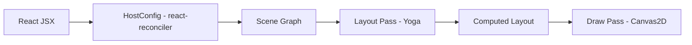

# @jiujue/react-canvas-fiber

[中文版](./docs/README.zh.md)

**A high-performance React custom renderer for HTML5 Canvas, integrated with Yoga Layout for Flexbox support.**

> Inspired by react-three-fiber, this project brings the declarative power of React and the layout capabilities of CSS Flexbox to the Canvas 2D context.

**Keywords**: react, canvas, renderer, fiber, yoga, layout, flexbox, 2d, ui, graphics

## ✨ Features

- **React Declarative UI**: Use standard JSX to build Canvas scenes.
- **Flexbox Layout**: Full layout system powered by [Yoga](https://yogalayout.com/) (supports `flex`, `padding`, `margin`, `gap`, etc.).
- **High Performance**: Batched updates via `requestAnimationFrame`, rendering only when necessary.
- **Event System**: DOM-like event bubbling and capturing (`onClick`, `onPointerOver`, etc.).
- **Developer Experience**: Dedicated Chrome DevTools extension for inspecting the scene graph.

## 📦 Installation

```bash
pnpm add @jiujue/react-canvas-fiber
```

> **Note**: This renderer requires **React 18**.

## 🚀 Usage

```tsx
import { Canvas, Image, Rect, Text, View } from '@jiujue/react-canvas-fiber'

export function App() {
	return (
		<Canvas
			width={800}
			height={600}
			style={{ border: '1px solid #ccc' }}
			dpr={window.devicePixelRatio}
		>
			<View
				style={{
					flex: 1,
					justifyContent: 'center',
					alignItems: 'center',
					gap: 20,
					background: '#0b1020',
				}}
			>
				<Text text="Hello Canvas!" style={{ fontSize: 32, fontWeight: 'bold' }} color="#e6edf7" />
				<Rect style={{ width: 100, height: 100 }} fill="#2b6cff" borderRadius={12} />
				<Image
					src="https://example.com/image.png"
					style={{ width: 80, height: 80 }}
					objectFit="cover"
					borderRadius={40}
				/>
			</View>
		</Canvas>
	)
}
```

## 🛠 Local Development

This is a monorepo managed by **pnpm**.

**Prerequisites**: Node.js + pnpm

1. **Install dependencies**

   ```bash
   pnpm install
   ```

2. **Start Demo App**

   ```bash
   pnpm dev
   ```

3. **Build All Packages**

   ```bash
   pnpm build
   ```

4. **Start Documentation Site**
   ```bash
   pnpm -C apps/dumi-docs dev
   ```

## 📂 Monorepo Structure

- **`packages/react-canvas-fiber`**: Core library ([README](./packages/react-canvas-fiber/README.md)).
- **`apps/demo`**: Vite + React demo application showcasing features.
- **`apps/dumi-docs`**: Documentation site (Dumi).
- **`apps/devtools-extension`**: Chrome DevTools extension source code.

## 📖 Documentation

- **[AI Guide](./packages/react-canvas-fiber/AI_GUIDE.md)**: A comprehensive guide for AI agents to understand, use, and extend this project.
- **[Skill Manual](./packages/react-canvas-fiber/SKILL.md)**: A manual for users and AI to quickly master the usage and troubleshooting.
- [Architecture Guide](./docs/ARCHITECTURE.md): Deep dive into the internal design and rendering pipeline.

- **Core Components**: [Canvas](./packages/react-canvas-fiber/README.md#canvas), [View](./packages/react-canvas-fiber/README.md#view), [Text](./packages/react-canvas-fiber/README.md#text), [Image](./packages/react-canvas-fiber/README.md#image), [Rect](./packages/react-canvas-fiber/README.md#rect)
- **Architecture Overview**: [ARCHITECTURE.md](./docs/ARCHITECTURE.md)
- **DevTools Guide**: [DevTools](./apps/dumi-docs/docs/guide/devtools.md)
- **Contribution Guide**: [CONTRIBUTING.md](./CONTRIBUTING.md)

## 🏗 Architecture

The renderer follows a pipeline similar to other React custom renderers:



1. **Reconciliation**: React diffs the Virtual DOM and calls HostConfig methods.
2. **Scene Graph**: A lightweight tree structure (`View`, `Text`, `Rect`) is maintained.
3. **Layout**: Yoga calculates layout (x, y, width, height) for the entire tree.
4. **Draw**: The tree is traversed to draw elements onto the 2D Context.

## 🤝 Contributing

Contributions are welcome! Please read [CONTRIBUTING.md](./CONTRIBUTING.md) for details on our code of conduct, and the process for submitting pull requests.

## 📄 License

MIT. See [LICENSE](./LICENSE).
