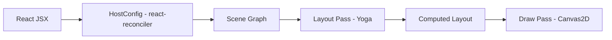

# @jiujue/react-canvas-fiber

[中文版](./docs/README.zh.md)

An experiment inspired by react-three-fiber: implement a custom React Renderer for `<canvas>`. Use JSX to declare a primitive tree, let React handle diffing, let the renderer maintain a scene graph, and run `layout -> draw` after each commit to render onto `<canvas>`.

## Monorepo Layout

- Core library (publishable package): [packages/react-canvas-fiber](./packages/react-canvas-fiber)
- Demo app (Vite + React): [apps/demo](./apps/demo)
- Docs site (dumi): [apps/dumi-docs](./apps/dumi-docs)
- DevTools extension (Chrome): [apps/devtools-extension](./apps/devtools-extension)

## Documentation

- Docs site source: [apps/dumi-docs/docs](./apps/dumi-docs/docs)
- DevTools guide: [devtools.md](./apps/dumi-docs/docs/guide/devtools.md)
- Architecture notes: [ARCHITECTURE.md](./docs/ARCHITECTURE.md) ([English](./docs/ARCHITECTURE.en.md))

## Quick Start

Prerequisites: Node.js + pnpm

```bash
pnpm install
pnpm dev
```

Build all workspaces (core library + demo):

```bash
pnpm build
```

Run docs site locally:

```bash
pnpm -C apps/dumi-docs dev
```

## DevTools Panel

A Chrome DevTools panel is provided for inspecting the scene tree / node highlighting / props inspection:

- Docs: [apps/dumi-docs/docs/guide/devtools.md](./apps/dumi-docs/docs/guide/devtools.md)
- Extension project: `apps/devtools-extension`

## Using the Core Library

The core package name is `@jiujue/react-canvas-fiber`. The demo consumes it via a workspace dependency:

Install from npm (once published):

```bash
pnpm add @jiujue/react-canvas-fiber
```

```tsx
import { Canvas, Image, Rect, Text, View } from '@jiujue/react-canvas-fiber'

export function Example() {
	return (
		<Canvas width={600} height={400} dpr={devicePixelRatio} clearColor="#0b1020">
			<View style={{ width: 600, height: 400, padding: 16, flexDirection: 'column', gap: 12 }}>
				<Text
					text="Hello Canvas Renderer"
					style={{ fontSize: 24, fontWeight: 700 }}
					color="#e6edf7"
				/>
				<Image
					src="https://gw.alipayobjects.com/zos/antfincdn/LlvErxo8H9/photo-1503149779833-1de50ebe5f8a.webp"
					style={{ width: 100, height: 100 }}
					borderRadius={12}
					objectFit="cover"
				/>
				<Rect style={{ width: 180, height: 44 }} borderRadius={10} fill="#2b6cff" />
			</View>
		</Canvas>
	)
}
```

## Architecture Overview

[Architecture Overview](./docs/ARCHITECTURE.md)

### Render Pipeline



### Key Modules

- Scene graph and node structure: `packages/react-canvas-fiber/src/runtime/nodes.ts`
- Reconciler HostConfig: `packages/react-canvas-fiber/src/runtime/reconciler.ts`
- Yoga style mapping and layout pass: `packages/react-canvas-fiber/src/layout/layoutTree.ts`
- Canvas2D drawing: `packages/react-canvas-fiber/src/render/drawTree.ts`
- React DOM bridge component `<Canvas/>`: `packages/react-canvas-fiber/src/components/Canvas.tsx`

## Design Goals (v1)

- Support JSX nodes like `View/Rect/Text`, and re-render after React diffs
- Support a subset of Yoga Flexbox layout: width/height, flexDirection, justifyContent, alignItems, padding/margin, position, gap
- Batch updates with `requestAnimationFrame`: multiple updates within one commit render only one frame

## Notes

- The current implementation is a “minimum viable skeleton”. Both drawing and layout are intentionally a subset, making it easier to extend later (e.g., Group/Transform, more primitives, event system, useFrame, etc.).

## Contributing

See [CONTRIBUTING.md](./CONTRIBUTING.md).

## License

MIT. See [LICENSE](./LICENSE).
