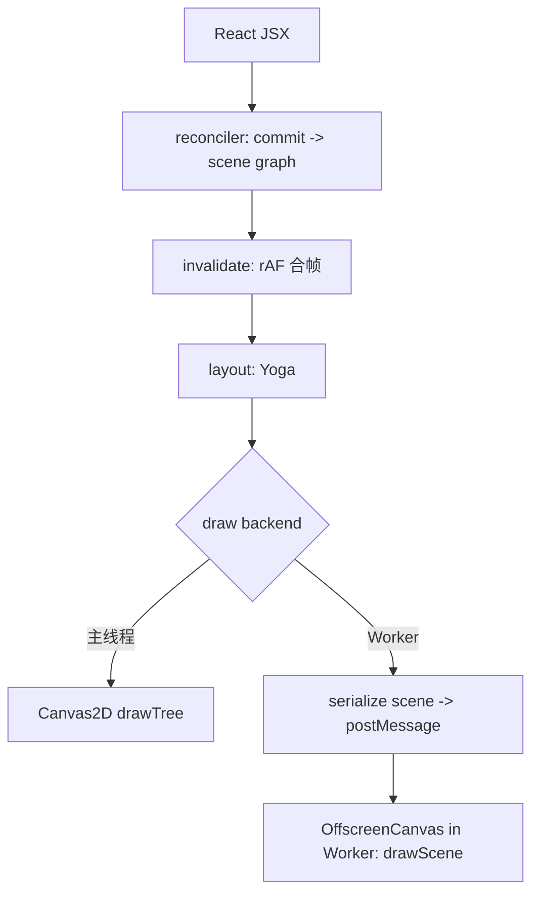

`Canvas` 是 React DOM 侧桥接组件：创建 `<canvas>`，初始化/销毁运行时 root，并把子树交给自定义 reconciler 渲染。

## 渲染管线（概览）



## 基础用法

```tsx | preview
import { Canvas, Rect, Text, View } from '@jiujue/react-canvas-fiber'

export default function Demo() {
	const dpr = typeof window !== 'undefined' ? window.devicePixelRatio || 1 : 1

	return (
		<Canvas
			width={720}
			height={360}
			dpr={dpr}
			clearColor="#0b1020"
			style={{ borderRadius: 12, border: '1px solid rgba(255,255,255,0.12)' }}
		>
			<View style={{ width: 720, height: 360, padding: 16, flexDirection: 'column', gap: 10 }}>
				<Text text="Canvas" style={{ fontSize: 18, fontWeight: 700 }} color="#e5e7eb" />
				<Rect style={{ width: 240, height: 54 }} borderRadius={14} fill="#60a5fa" />
			</View>
		</Canvas>
	)
}
```

## Worker 绘制（OffscreenCanvas）

当浏览器支持 `OffscreenCanvas + transferControlToOffscreen + Worker` 时，可以把 **draw pass** 放到 Worker，主线程仍负责 React commit 与 Yoga layout。

```tsx | preview
import { Canvas, Rect, Text, View } from '@jiujue/react-canvas-fiber'

export default function Demo() {
	const dpr = typeof window !== 'undefined' ? window.devicePixelRatio || 1 : 1

	return (
		<Canvas
			width={720}
			height={360}
			dpr={dpr}
			clearColor="#0b1020"
			worker={{ debug: { visualize: { nodeBounds: true } } }}
			style={{ borderRadius: 12, border: '1px solid rgba(255,255,255,0.12)' }}
		>
			<View style={{ width: 720, height: 360, padding: 16, flexDirection: 'column', gap: 10 }}>
				<Text
					text="Worker Draw Enabled"
					style={{ fontSize: 18, fontWeight: 700 }}
					color="#e5e7eb"
				/>
				<Rect style={{ width: 240, height: 54 }} borderRadius={14} fill="#22c55e" />
			</View>
		</Canvas>
	)
}
```

注意：一旦把 DOM `canvas` `transferControlToOffscreen()` 交给 Worker，通常无法再切回主线程 `getContext('2d')`。建议在创建 root 时就确定是否使用 Worker。

## Props

```ts
type CanvasProps = {
	width: number
	height: number
	dpr?: number
	clearColor?: string
	fontFamily?: string
	fontSize?: number
	fontWeight?: number | string
	lineHeight?: number
	profiling?: boolean | { maxFrames?: number; sceneSampleEveryNFrames?: number }
	worker?:
		| boolean
		| { debug?: import('@jiujue/react-canvas-fiber').CanvasWorkerDebugOptions | null }
	style?: import('react').CSSProperties
	children?: import('react').ReactNode
}
```

## 字体默认值

`Canvas` 上的 `fontFamily/fontSize/fontWeight/lineHeight` 用作默认值，供 `Text` 节点绘制与测量使用。
