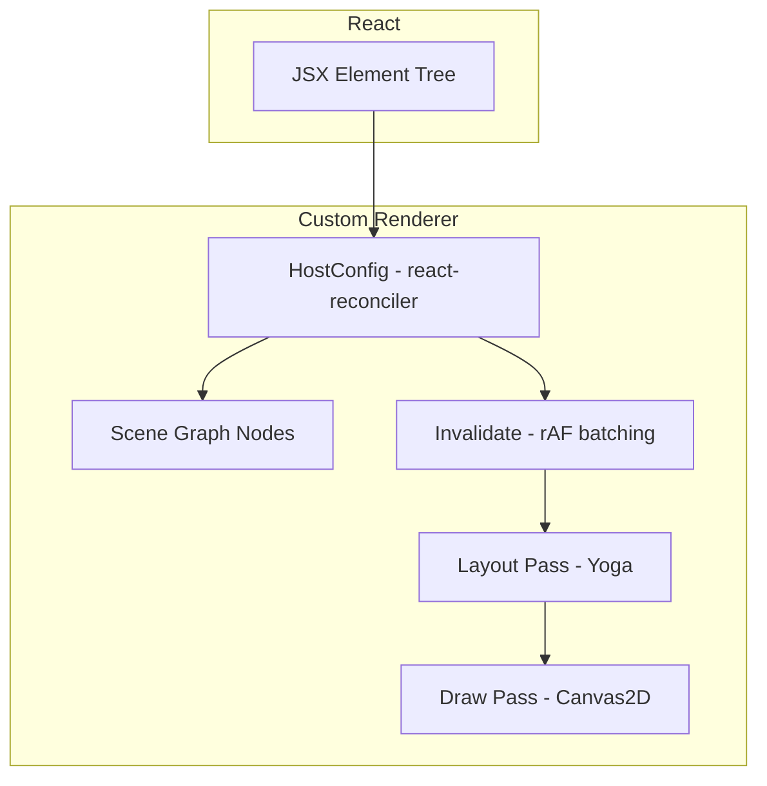

# Architecture & Implementation Notes

This document describes the core implementation of `react-canvas-fiber`: how React commits are connected to Yoga layout and Canvas2D drawing to form an extensible render pipeline.

## Overview

## Directories & Responsibilities

### Scene Graph

- `packages/react-canvas-fiber/src/runtime/nodes.ts`
  - Defines node types: `View/Rect/Text` and the container `Root`
  - Stores three key kinds of state:
    - `props`: attributes from JSX
    - `children/parent`: tree structure
    - `layout`: `x/y/width/height` computed by Yoga

### Reconciler (React Commit Phase)

- `packages/react-canvas-fiber/src/runtime/reconciler.ts`
  - Uses `react-reconciler` in Mutation mode to maintain the `children` array
  - After each React commit, calls `invalidate()` to batch layout + draw into the next frame

Core conventions:

- JSX components like `<View/> <Rect/> <Text/>` return intrinsic elements (string types)
- `createInstance(type, props)` creates a scene node based on the `type`
- `commitUpdate` updates node `props` (current implementation replaces the whole object)

### Layout Pass (Yoga)

- `packages/react-canvas-fiber/src/layout/layoutTree.ts`
  - Loads WASM asynchronously via `yoga-layout/load`
  - Maps a subset of `style` to Yoga APIs (width/height/flex/padding/margin/position/gap, etc.)
  - For `Text` nodes, injects `setMeasureFunc` so Yoga can call an external `measureText` when it needs sizing

Layout flow:

1. Sync scene tree structure into a Yoga tree
2. Run `calculateLayout`
3. Read `getComputedLayout()` and write it back to `node.layout`

### Draw Pass (Canvas2D)

- `packages/react-canvas-fiber/src/render/drawTree.ts`
  - Uses `layout` as the source of truth for each node’s final draw rect
  - Recursively traverses the subtree, accumulating coordinates with parent offsets
  - Uses `ctx.setTransform(dpr, 0, 0, dpr, 0, 0)` for high-DPI rendering

## Runtime Root (Wiring Everything Together)

- `packages/react-canvas-fiber/src/runtime/root.ts`
  - Implements `dirty + requestAnimationFrame` batching
  - Each frame runs: `layoutTree -> drawTree`
  - `measureText` uses `ctx.measureText` as a minimal measurement implementation

## Public API

- `packages/react-canvas-fiber/src/components/Canvas.tsx`
  - React DOM component: creates a `<canvas>` and initializes/disposes the renderer root in `useLayoutEffect`
- `packages/react-canvas-fiber/src/jsx/index.ts`
  - Props definitions for `View/Rect/Text` and the JSX factory (returns intrinsic elements)
- `packages/react-canvas-fiber/src/intrinsics.d.ts`
  - Enables TS to recognize `<View /> <Rect /> <Text />` on the user side

## Extension Points (Common Next Steps)

- Add primitives: extend `NodeType` + add a `drawNode` branch + add a matching JSX component
- Transform/Group: add save/translate/rotate/scale in draw, and render subtree within a transform context
- Event system: implement hit-testing (based on layout/draw paths) and dispatch pointer events from the Canvas to nodes
- useFrame: add a subscription callback queue in the root rAF loop (similar to R3F)
