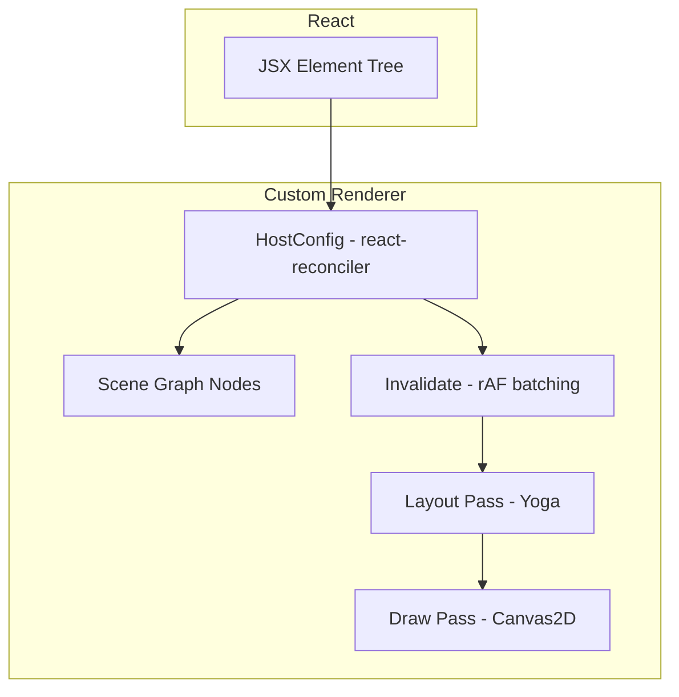

# 架构与实现说明

本文档描述 `react-canvas-fiber` 的核心实现：如何把 React 的提交（commit）串联到 Yoga 布局与 Canvas2D 绘制，形成一个可扩展的渲染管线。

## 总览



## 目录与职责

### Scene Graph

- `packages/react-canvas-fiber/src/runtime/nodes.ts`
  - 定义节点类型：`View/Rect/Text` 以及容器 `Root`
  - 保存三类关键状态：
    - `props`：来自 JSX 的属性
    - `children/parent`：树结构
    - `layout`：Yoga 计算后的 `x/y/width/height`

### Reconciler（React 提交阶段）

- `packages/react-canvas-fiber/src/runtime/reconciler.ts`
  - 使用 `react-reconciler` 的 Mutation 模式维护 `children` 数组
  - React 每次提交后触发 `invalidate()`，把布局与绘制合并到下一帧

核心约定：

- JSX 组件 `<View/> <Rect/> <Text/>` 返回 intrinsic element（字符串 type）
- `createInstance(type, props)` 根据 type 创建场景节点
- `commitUpdate` 更新节点 `props`（当前实现直接整体替换）

### Layout Pass（Yoga）

- `packages/react-canvas-fiber/src/layout/layoutTree.ts`
  - 通过 `yoga-layout/load` 异步加载 WASM
  - 将 `style` 子集映射为 Yoga API（width/height/flex/padding/margin/position/gap 等）
  - 对 `Text` 节点注入 `setMeasureFunc`，在 Yoga 询问尺寸时调用外部传入的 `measureText`

布局流程：

1. 同步场景树结构到 Yoga 树
2. `calculateLayout`
3. 读取 `getComputedLayout()` 并回写到 `node.layout`

### Draw Pass（Canvas2D）

- `packages/react-canvas-fiber/src/render/drawTree.ts`
  - 以 `layout` 为准计算每个节点的最终绘制矩形
  - 递归遍历子树，使用父节点偏移做坐标累加
  - 用 `ctx.setTransform(dpr, 0, 0, dpr, 0, 0)` 支持高清渲染

## 运行时 Root（把三段串起来）

- `packages/react-canvas-fiber/src/runtime/root.ts`
  - 维护 `dirty + requestAnimationFrame` 合帧逻辑
  - 每帧执行：`layoutTree -> drawTree`
  - `measureText` 用 `ctx.measureText` 做最小测量实现

### rAF 合帧与脏标记

运行时 root 内部维护两类“脏”：

- `dirtyLayout`：需要重新跑 Yoga 布局（会隐含触发一次 draw）
- `dirtyDraw`：只需要重新绘制（例如滚动、hover overlay）

当前行为的关键点：

- React 每次 commit 后会调用 `container.invalidate()`，直接把 `dirtyLayout=true` 与 `dirtyDraw=true`（等价于“每次更新都做 layout + draw”）
- `invalidateDrawOnly()` 只置 `dirtyDraw=true`，不会触发 Yoga
- rAF 合帧：同一帧内多次 `invalidate` 只会安排一次 `requestAnimationFrame`

## 对外 API

- `packages/react-canvas-fiber/src/components/Canvas.tsx`
  - React DOM 组件：创建 `<canvas>` 并在 `useLayoutEffect` 中初始化/销毁 renderer root
- `packages/react-canvas-fiber/src/jsx/index.ts`
  - `View/Rect/Text` 的 props 定义与 JSX 工厂（返回 intrinsic element）
- `packages/react-canvas-fiber/src/intrinsics.d.ts`
  - 让 TS 在用户侧识别 `<View /> <Rect /> <Text />`

### JSX 声明式 Canvas UI 的工作方式

本项目的 JSX “声明式”本质是：

- 用户写 `<View /> <Text /> <Rect />` 这类“自定义 intrinsic element”
- React 在 reconciler 内部把它们当作 host component（字符串 type）
- 自定义 renderer 的 `createInstance(type, props)` 将其实例化为场景树节点 `CanvasNode`
- 每次 commit 后下一帧统一跑 `layoutTree(rootNode) -> drawTree(rootNode)`

在用户侧，它看起来像普通 React UI：

```tsx
import { Canvas, View, Text, Rect } from '@jiujue/react-canvas-fiber'

export function App() {
	return (
		<Canvas width={800} height={600} dpr={window.devicePixelRatio}>
			<View style={{ width: 800, height: 600, paddingTop: 20 }} background="#111827">
				<Text text="Hello Canvas UI" color="#fff" />
				<Rect style={{ width: 200, height: 80, marginTop: 12 }} fill="#3b82f6" />
			</View>
		</Canvas>
	)
}
```

但在实现上：

- `<Canvas />` 负责 DOM canvas 的创建、事件监听与 root 生命周期
- `<View/> <Text/> ...` 不会渲染到 DOM，它们只产生 React element，由 renderer 接管

### 事件系统（命中测试 + 派发）

事件入口在 Canvas DOM 节点：

- `Canvas.tsx` 将 pointer/wheel 事件转为“画布逻辑坐标”，交给 `root.dispatchPointerEvent / dispatchWheelEvent`

命中测试与事件派发在运行时 root：

- `root.ts`
  - `hitTestTree(...)`：基于 `layout + transform + clip/scroll` 的 DFS 命中测试
  - `dispatchOnPath(...)`：构造冒泡路径，支持 capture/bubble 以及 `stopPropagation / preventDefault`
  - 滚动条交互：对 scroll 容器额外做 scrollbar thumb 的命中与拖拽逻辑

需要注意：

- Path 的命中在必要时会走 `ctx.isPointInPath / isPointInStroke`（相对更重）
- pointermove 会触发 hover enter/leave 模拟，需要避免在复杂场景下做过多额外工作

### Devtools 与性能采样

- `root.ts` 会在浏览器里注册到 `window.__REACT_CANVAS_FIBER_DEVTOOLS__`，提供 snapshot、node props、命中测试等能力
- 若 `<Canvas profiling />` 开启 profiling，会记录每帧 `layoutMs/drawMs/overlayMs` 与 Canvas API 调用计数，便于定位瓶颈

## 扩展点（后续常见需求）

- 增加图元：扩展 `NodeType` + `drawNode` 分支 + 对应 JSX 组件
- Transform/Group：在 draw 阶段增加 save/translate/rotate/scale，并把子树渲染置于 transform 上下文
- 事件系统：建立命中测试（基于 layout/绘制路径）并在 Canvas 上监听 pointer 事件派发到节点
- useFrame：在 root 的 rAF 回调中增加订阅回调队列（R3F 类似）
