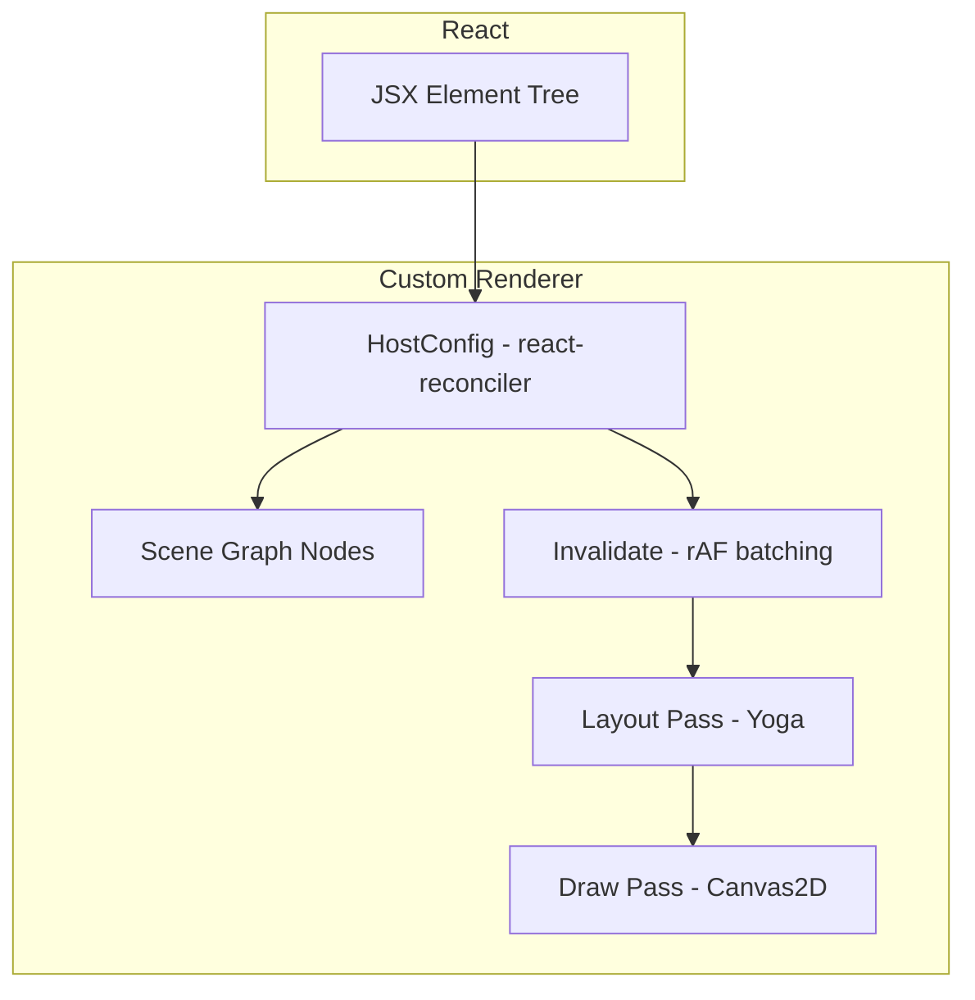

# 架构与实现说明

本文档描述 `react-canvas-fiber` 的核心实现：如何把 React 的提交（commit）串联到 Yoga 布局与 Canvas2D 绘制，形成一个可扩展的渲染管线。

## 总览

## 目录与职责

### Scene Graph

- `packages/react-canvas-fiber/src/nodes.ts`
  - 定义节点类型：`View/Rect/Text` 以及容器 `Root`
  - 保存三类关键状态：
    - `props`：来自 JSX 的属性
    - `children/parent`：树结构
    - `layout`：Yoga 计算后的 `x/y/width/height`

### Reconciler（React 提交阶段）

- `packages/react-canvas-fiber/src/reconciler.ts`
  - 使用 `react-reconciler` 的 Mutation 模式维护 `children` 数组
  - React 每次提交后触发 `invalidate()`，把布局与绘制合并到下一帧

核心约定：

- JSX 组件 `<View/> <Rect/> <Text/>` 返回 intrinsic element（字符串 type）
- `createInstance(type, props)` 根据 type 创建场景节点
- `commitUpdate` 更新节点 `props`（当前实现直接整体替换）

### Layout Pass（Yoga）

- `packages/react-canvas-fiber/src/layout.ts`
  - 通过 `yoga-layout/load` 异步加载 WASM
  - 将 `style` 子集映射为 Yoga API（width/height/flex/padding/margin/position/gap 等）
  - 对 `Text` 节点注入 `setMeasureFunc`，在 Yoga 询问尺寸时调用外部传入的 `measureText`

布局流程：

1. 同步场景树结构到 Yoga 树
2. `calculateLayout`
3. 读取 `getComputedLayout()` 并回写到 `node.layout`

### Draw Pass（Canvas2D）

- `packages/react-canvas-fiber/src/draw.ts`
  - 以 `layout` 为准计算每个节点的最终绘制矩形
  - 递归遍历子树，使用父节点偏移做坐标累加
  - 用 `ctx.setTransform(dpr, 0, 0, dpr, 0, 0)` 支持高清渲染

## 运行时 Root（把三段串起来）

- `packages/react-canvas-fiber/src/root.ts`
  - 维护 `dirty + requestAnimationFrame` 合帧逻辑
  - 每帧执行：`layoutTree -> drawTree`
  - `measureText` 用 `ctx.measureText` 做最小测量实现

## 对外 API

- `packages/react-canvas-fiber/src/Canvas.tsx`
  - React DOM 组件：创建 `<canvas>` 并在 `useLayoutEffect` 中初始化/销毁 renderer root
- `packages/react-canvas-fiber/src/jsx.ts`
  - `View/Rect/Text` 的 props 定义与 JSX 工厂（返回 intrinsic element）
- `packages/react-canvas-fiber/src/intrinsics.d.ts`
  - 让 TS 在用户侧识别 `<View /> <Rect /> <Text />`

## 扩展点（后续常见需求）

- 增加图元：扩展 `NodeType` + `drawNode` 分支 + 对应 JSX 组件
- Transform/Group：在 draw 阶段增加 save/translate/rotate/scale，并把子树渲染置于 transform 上下文
- 事件系统：建立命中测试（基于 layout/绘制路径）并在 Canvas 上监听 pointer 事件派发到节点
- useFrame：在 root 的 rAF 回调中增加订阅回调队列（R3F 类似）
