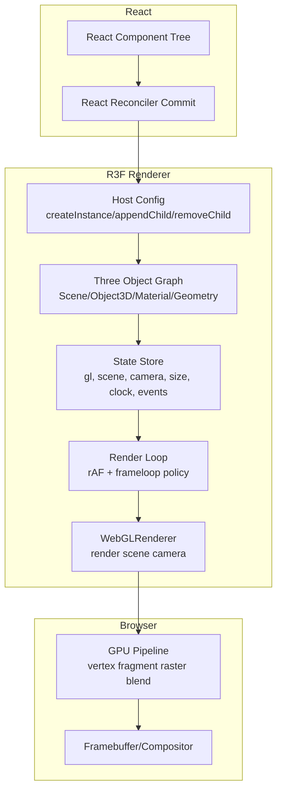

# react-three-fiber（R3F）深度架构与性能工程：分析、对比实验与落地路线图

> 范围声明：本文档聚焦 **react-three-fiber（@react-three/fiber）+ three.js** 的系统架构与性能机制，并给出一套可复用的 **基准测试/对比实验/CI 回归** 方案与落地路线图。  
> 仓库现状声明：当前仓库 `@jiujue/react-canvas-fiber` 是 **Canvas2D 自定义渲染器**，代码中未引入 three.js / babylon.js 等 3D 引擎；因此本文的“横向对比实验数据”以 **实验设计 + 可填充模板** 的形式交付，数值需在目标业务场景/设备矩阵上实测后回填。

---

## 目录

- [1. 目标与结论摘要](#1-目标与结论摘要)
- [2. R3F 核心架构总览](#2-r3f-核心架构总览)
- [3. React 调度器 × Three.js 渲染循环深度融合](#3-react-调度器--threejs-渲染循环深度融合)
- [4. 虚拟化场景图与增量式状态同步](#4-虚拟化场景图与增量式状态同步)
- [5. GPU 实例化与批处理：Draw Call 预算模型](#5-gpu-实例化与批处理draw-call-预算模型)
- [6. 内存池与对象复用：从 GC 压力到 GPU 资源泄漏](#6-内存池与对象复用从-gc-压力到-gpu-资源泄漏)
- [7. 多线程加载：Web Worker / WASM / OffscreenCanvas](#7-多线程加载web-worker--wasm--offscreencanvas)
- [8. 自动 LOD 与视锥剔除：几何/像素两条降本链路](#8-自动-lod-与视锥剔除几何像素两条降本链路)
- [9. Suspense 异步资源流式加载：首帧与可交互的工程化](#9-suspense-异步资源流式加载首帧与可交互的工程化)
- [10. 多维性能评估模型与指标口径](#10-多维性能评估模型与指标口径)
- [11. 横向对比实验设计：R3F vs Babylon/Raw Three/Unity/PlayCanvas/Cesium/Oasis/自研](#11-横向对比实验设计r3f-vs-babylonraw-threeunityplaycanvascesiumoasis自研)
- [12. 瓶颈环节量化与根因假设库（可验证）](#12-瓶颈环节量化与根因假设库可验证)
- [13. 可落地性能优化路线图（8 项）](#13-可落地性能优化路线图8-项)
- [14. 基准、测试报告与回归门禁（模板）](#14-基准测试报告与回归门禁模板)
- [15. CI 集成步骤（可直接复制）](#15-ci-集成步骤可直接复制)
- [16. 版本回滚策略（含 Service Worker 版本化）](#16-版本回滚策略含-service-worker-版本化)
- [17. 团队分工与排期（可执行）](#17-团队分工与排期可执行)
- [18. ADR 决策记录（样例，可扩展）](#18-adr-决策记录样例可扩展)
- [19. 可复制脚手架命令与配置模板](#19-可复制脚手架命令与配置模板)
- [附录 A：术语表](#附录-a术语表)
- [附录 B：工具清单](#附录-b工具清单)

---

## 1. 目标与结论摘要

**性能目标（门禁）**

- 首帧可交互（TTI）< 1.5s（中端移动设备 + 4G/弱网 profile）
- 复杂场景稳定 60 FPS（或 16.7ms P50 / 22ms P95 帧时间）
- 内存峰值 < 256MB（含 JS Heap + GPU 纹理/几何估算 + 解码缓存）
- 包体积减少 30%+（主包 gzip/brotli，含动态分包策略）

**R3F 的关键价值点（为何能“更快/更稳/更可控”）**

- 以 React Reconciler 为内核，把 JSX 变成 three.js 对象树的“增量补丁”，避免手写庞杂的命令式同步。
- 渲染循环（rAF）与 React 更新形成“协作式合帧”：支持持续渲染与按需渲染，按需渲染通过 `frameloop="demand"` + `invalidate()` 把空闲帧归零（官方建议路径）[来源](https://r3f.docs.pmnd.rs/advanced/scaling-performance)。
- 资源加载天然可走 Suspense：把 IO/解码/编译延迟从主线程关键路径移出，配合预加载/分包，显著改善 TTI 与卡顿分布。

---

## 2. R3F 核心架构总览

R3F 本质是一个 **React 自定义渲染器**：React 的“提交（commit）”阶段不再落到 DOM，而是落到 three.js 的对象模型（`Scene`、`Mesh`、`Material`、`Texture`…）。

### 2.1 组件到对象：从 JSX 到 Three Object3D

**心智模型**

- JSX 节点 ≈ three.js 对象实例（或其属性/生命周期）
- React diff ≈ 属性补丁（`applyProps`）+ 子树增删（`attach`/`remove`）+ 资源释放（`dispose`）
- commit 后 ≈ 标记“需要渲染”，由 render loop 决定是否绘制一帧/持续绘制

### 2.2 系统分层



### 2.3 三条关键闭环

- **更新闭环（React → Three）**：commit 产生“对象树补丁”，最小化写入与重建。
- **渲染闭环（Three → GPU）**：按需/持续渲染控制帧预算，避免空转。
- **交互闭环（Pointer → Raycast → React handlers）**：事件从 DOM 输入映射到 3D 命中，再回到 React 事件回调。

---

## 3. React 调度器 × Three.js 渲染循环深度融合

### 3.1 为什么“融合”是性能关键

在传统 three.js 命令式工程中，开发者容易把“状态更新”与“渲染循环”耦合为：

- 每次状态变化都立即写三维对象属性（可能频繁、碎片化）
- render loop 无条件 60 FPS 持续跑（即便静止）

R3F 的工程优势在于：把 React 的“批处理/合并更新”与 three.js 的“帧渲染”连接起来，形成更清晰的性能控制面。

### 3.2 `frameloop`：持续渲染 vs 按需渲染

R3F 官方建议：当场景允许静止时，使用按需渲染，核心是：

- `<Canvas frameloop="demand" />`：当检测到 props 变化时才渲染一帧
- 对“非 React 可见的变更”（如 controls 直接 mutate camera）用 `invalidate()` 手动请求下一帧 [来源](https://r3f.docs.pmnd.rs/advanced/scaling-performance)

**关键点**

- `invalidate()` 不是立刻 render，而是“请求渲染一帧”，可把多次请求折叠为一次（实现细节随版本变化，需以当前版本行为为准）[讨论](https://github.com/pmndrs/react-three-fiber/issues/3186)。

### 3.3 `useFrame`：把“每帧更新”限定在可审计的边界

`useFrame(fn, priority?)` 是把组件接入 render loop 的主要入口。它的性能风险不在 hook 本身，而在回调内是否做了昂贵工作（例如每帧遍历大对象树、分配大量临时对象等）。社区维护者明确指出 `useFrame` 本质是 render loop 内一次函数调用，关键在回调内容[讨论](https://github.com/pmndrs/react-three-fiber/discussions/1800)。

**推荐约束**

- 每帧回调只做：少量矩阵/混合器 update、少量 uniform 更新、少量状态推进
- 禁止每帧：创建新几何/材质、加载资源、批量分配数组、深层递归遍历

### 3.4 时间切片（Time-slicing）与并发渲染（Concurrent Rendering）

React 18 让“更新”可以被调度、打断、恢复。对 3D 场景而言，时间切片价值在于：

- 把非关键更新（例如 UI 面板、不可见对象、远处 LOD）拆成更细粒度的提交
- 避免一次性 commit 导致长任务（Long Task）拉高帧时间 P95

工程实现上，关键在于把“重工作”从 React commit 中移出：

- 资源 IO/解码：交给 Suspense + loader cache
- 大批量 transform 计算：交给 Worker/WASM（见第 7 节）
- 绘制层面的合批：交给 Instancing/BatchedMesh（见第 5 节）

---

## 4. 虚拟化场景图与增量式状态同步

### 4.1 “虚拟化”的含义

R3F 不会把每次 React render 的结果直接“重建”到 three.js。它维护：

- React Fiber Tree（React 内部）
- Three Object Graph（真实 three.js 对象树）

两者通过 reconciler 的 host config 在 commit 阶段进行 **增量同步**。

### 4.2 增量同步的性能收益

对每个组件节点而言，理想路径是：

1. React diff 判断哪些 props 变化
2. R3F 仅对变化字段执行 `applyProps`
3. 避免重建 `Geometry/Material/Texture`（除非类型或关键参数变化）

**关键工程规则**

- 把“高频变化”集中到少量字段（如矩阵、uniform），避免对象级替换
- 用 `useMemo`/`useRef` 固定几何/材质引用，避免 React 重渲染时创建新实例
- 对重复资源使用全局缓存或 `useLoader` 缓存（`useLoader` 默认缓存同 URL 资源）[来源](https://r3f.docs.pmnd.rs/advanced/scaling-performance)

### 4.3 场景图遍历与更新的“预算线”

在 60 FPS 目标下，主线程每帧预算约 16.7ms，其中还包含：

- 输入事件处理、布局、React 自身工作
- 资源解码/编译触发的卡顿

因此“每帧遍历 N 个对象”的成本需要被量化并门禁化（见第 10/11/14 节）。结论通常是：

- 可接受：每帧更新几百～几千个 transform（取决于设备）
- 不可接受：每帧深遍历 tens-of-thousands 对象并做复杂逻辑

---

## 5. GPU 实例化与批处理：Draw Call 预算模型

### 5.1 Draw Call 是第一预算线

在 WebGL/Three 的经典瓶颈里，Draw Call 与状态切换（材质/纹理/UBO）是最常见的上限来源之一。

R3F 官方性能建议强调：每个 mesh 通常意味着一次 draw call，应对其保持警惕，几百以内更理想，上千已接近上限，重复物体应优先实例化 [来源](https://r3f.docs.pmnd.rs/advanced/scaling-performance)。

### 5.2 方案矩阵：InstancedMesh / Merged Geometry / BatchedMesh

| 方案                              |                Draw Call | 适用场景                           | 代价/限制                          |
| --------------------------------- | -----------------------: | ---------------------------------- | ---------------------------------- |
| `InstancedMesh`                   | 极低（同材质/几何 1 次） | 大量重复对象（树、草、粒子、道具） | 每实例差异受限（材质变化难）       |
| 合并几何（merge）                 |                       低 | 静态场景、地形分块、建筑群         | 更新困难；剔除粒度变粗             |
| `BatchedMesh`（自定义或引擎扩展） |                     很低 | “批量静态/半静态”对象              | 复杂度高；需要严格资源生命周期管理 |
| `Points`/粒子系统                 |                  1～少量 | 超大规模点云/粒子                  | 需要专用 shader/属性布局           |

### 5.3 使用 drei 的 Instances / Points（路线图第 13.1）

目标：把“重复几何”的 N 次 draw call 压缩到 O(1)。

伪代码（表达结构，不代表可直接运行）：

```tsx
import { Instances, Instance } from '@react-three/drei'

function Forest({ transforms }) {
	return (
		<Instances limit={transforms.length} range={transforms.length}>
			<meshStandardMaterial />
			<boxGeometry />
			{transforms.map((t, i) => (
				<Instance key={i} position={t.p} rotation={t.r} scale={t.s} />
			))}
		</Instances>
	)
}
```

**验证指标**

- Draw Call 数（SpectorJS / three stats）
- CPU 帧时间（主线程）
- GPU 时间（如可用，通过 WebGL timer query / Chrome tracing 辅助）

---

## 6. 内存池与对象复用：从 GC 压力到 GPU 资源泄漏

3D 性能掉帧往往不是“算不动”，而是：

- 主线程频繁分配导致 GC 抖动（帧时间尾部上升）
- GPU 资源（纹理/缓冲）泄漏导致显存压力与系统回收抖动

### 6.1 对象复用：几何/材质/临时向量

**复用原则**

- 几何与材质优先“共享引用”而非“每个物体独立 new”
- 高频临时对象（`Vector3/Matrix4/Quaternion`）用“单例临时变量”或对象池复用

伪代码：

```ts
const tempMatrix = new Matrix4()
const tempVec3 = new Vector3()

function updateInstance(i, p) {
	tempVec3.set(p.x, p.y, p.z)
	tempMatrix.compose(tempVec3, quatIdentity, scaleOne)
	instancedMesh.setMatrixAt(i, tempMatrix)
}
```

### 6.2 资源释放与生命周期：dispose 策略

**风险**

- 频繁创建/销毁 `Texture/Material/Geometry` 会触发 GPU 端反复分配释放，带来帧抖动
- 忘记释放会导致 GPU 内存爬升，最终触发系统级回收/上下文丢失

**工程建议**

- 热路径禁止创建新资源：把资源初始化放在加载阶段或首次 mount
- 引入“资源注册表”：统一管理纹理/几何/材质的引用计数与销毁时机
- 对动态加载资源结合“版本化缓存”（第 13.7、16 节）

---

## 7. 多线程加载：Web Worker / WASM / OffscreenCanvas

### 7.1 Loader 侧多线程：解码与解析移出主线程

常见链路：

- Draco / Meshopt：几何压缩解码（多用 Worker/WASM）
- KTX2 / Basis：纹理压缩解码与转码（多用 Worker/WASM）

工程目标：

- 把“网络 IO + 解码 + 解析”拆到 Worker/WASM
- 主线程仅做必要的 GPU 上传与场景挂载

### 7.2 OffscreenCanvas：多线程渲染（实验性）

OffscreenCanvas 允许在 Worker 中执行渲染，但实际可行性受限于：

- 浏览器支持度与 WebGL 上下文转移细节
- DOM 事件与 Worker 渲染的协同
- 资源加载与线程边界（传输/共享）成本

落地建议：

- 作为路线图第 13.2 的“可选项”，优先在独立 PoC 与设备矩阵上评估，再决定是否纳入主线。

### 7.3 Worker + WASM：把物理与动画推进移出主线程（路线图第 13.5）

适用对象：

- 物理：碰撞检测、刚体模拟
- 动画：大量骨骼/IK、群体行为、路径规划

关键是“数据接口”：

- 主线程只接收“姿态结果”（矩阵/四元数/关键骨骼）
- Worker 内进行大规模计算，必要时使用 SharedArrayBuffer（注意 COOP/COEP 配置）

---

## 8. 自动 LOD 与视锥剔除：几何/像素两条降本链路

### 8.1 视锥剔除（Frustum Culling）

three.js 默认对多数 `Object3D` 具备视锥剔除能力（`frustumCulled`）。但其收益依赖：

- 对象数量与包围体更新成本
- 合批策略是否导致包围体变粗（例如把很多对象 merge 成一个 mesh）

**工程策略**

- 静态对象：使用更粗粒度的空间分块（tile/chunk），让剔除发生在 chunk 粒度
- 动态对象：尽量避免每帧重算复杂包围体

### 8.2 LOD（Level of Detail）

LOD 的本质是：以距离/屏幕像素覆盖为条件，选择不同复杂度资产。

**落地路径**

- 资产侧：同一对象提供 LOD0/1/2（不同三角形/贴图分辨率）
- 运行时：按距离/像素阈值切换，并与缓存策略联动（避免抖动加载）

### 8.3 遮挡剔除（Occlusion / PVS）

WebGL/three.js 默认没有成熟的运行时遮挡剔除体系。要达成“自动遮挡剔除”，通常需要：

- Tile-Based 场景分块 + PVS（Potentially Visible Set）
- 或基于 Hierarchical Z / 软件栅格的近似遮挡判定（复杂度高）

这也是路线图第 13.4 的核心内容。

---

## 9. Suspense 异步资源流式加载：首帧与可交互的工程化

### 9.1 Suspense 的价值：把加载建模为“渲染依赖”

在 R3F 生态中，loader 通常与 Suspense 协作：

- 未加载完成时抛出 promise → 触发 fallback
- 完成后继续渲染 → 资源自然进入缓存（如 `useLoader` 对同 URL 资源缓存）[来源](https://r3f.docs.pmnd.rs/advanced/scaling-performance)

### 9.2 首帧策略：拆分“可见性”与“完备性”

推荐分层：

- L0：极简占位（低多边形、单色材质、无后处理）
- L1：主模型与基础灯光
- L2：高质量材质、后处理、阴影、高 LOD

这样首帧的目标不是“全质量”，而是“可交互 + 不掉帧”。

---

## 10. 多维性能评估模型与指标口径

### 10.1 指标定义（统一口径）

| 维度     | 指标                          | 口径                                      | 采集方式                      |
| -------- | ----------------------------- | ----------------------------------------- | ----------------------------- |
| 帧率     | FPS                           | 平均 + P5/P50/P95 帧时间                  | r3f-perf / 自采样             |
| 帧时间   | Frame Time                    | 主线程/合成线程拆分                       | Chrome Performance/Tracing    |
| GPU      | GPU Busy / GPU Time           | 可用则用 timer query；否则用 tracing 近似 | SpectorJS + Tracing           |
| 内存     | JS Heap / 纹理解码 / GPU 估算 | 峰值 + 稳态                               | Performance.memory + DevTools |
| 包体积   | main/chunk gzip               | 构建产物统计                              | bundler report                |
| 首帧     | FCP / TTI                     | 可交互定义：关键交互可响应                | Lighthouse + 自定义 marker    |
| 动态加载 | load/decode/upload            | 分段计时                                  | Resource Timing + 自埋点      |

### 10.2 采样协议（建议）

- 预热：进入场景后预热 N 秒，排除 JIT 与首次 shader 编译抖动
- 采样：固定相机路径（录制轨迹），采样 60～120 秒
- 设备矩阵：桌面高端 / 桌面集显 / Android 中端 / iOS 中端
- 负载矩阵：静止、相机移动、交互密集、资源流式加载

---

## 11. 横向对比实验设计：R3F vs Babylon/Raw Three/Unity/PlayCanvas/Cesium/Oasis/自研

### 11.1 实验总则：同场景、同资产、同指标、同设备

为了避免“框架差异 = 场景差异”的伪结论，建议建立 **标准化 benchmark suite**：

- 同一套 glTF（含压缩版本、LOD 版本）、同一套纹理（含 KTX2）、同一套灯光/阴影配置
- 同一相机路径（录制轨迹）
- 同一交互脚本（点击/悬停/拖拽）

### 11.2 场景集合（建议 6 类）

| 场景 ID              | 目的               | 核心压力源                     | 关键指标       |
| -------------------- | ------------------ | ------------------------------ | -------------- |
| S1 Instancing Forest | 实例化收益评估     | draw call / transform 更新     | FPS、draw call |
| S2 Material Zoo      | 材质编译与变体爆炸 | shader compile、pipeline state | 首次卡顿、P95  |
| S3 Texture Upload    | 纹理上传/带宽      | upload、mipmap、cache miss     | TTI、GPU busy  |
| S4 Skinned Crowd     | 骨骼动画压力       | CPU 骨骼推进 / GPU skinning    | 帧时间尾部     |
| S5 Events Heavy      | 事件/拾取压力      | raycast、BVH、分发             | 交互延迟       |
| S6 Tile World        | 分块/LOD/遮挡      | chunk 管理、PVS                | 动态加载耗时   |

### 11.3 结果表（回填模板）

| 引擎/方案       | S1 FPS(P50/P95) | S1 DrawCall | S2 首次卡顿(ms) | S3 TTI(s) | S4 P95(ms) | S5 交互延迟(ms) | S6 动态加载(s) | 内存峰值(MB) | 包体积(gzip MB) |
| --------------- | --------------: | ----------: | --------------: | --------: | ---------: | --------------: | -------------: | -----------: | --------------: |
| R3F + Three     |             TBD |         TBD |             TBD |       TBD |        TBD |             TBD |            TBD |          TBD |             TBD |
| Raw Three.js    |             TBD |         TBD |             TBD |       TBD |        TBD |             TBD |            TBD |          TBD |             TBD |
| Babylon.js      |             TBD |         TBD |             TBD |       TBD |        TBD |             TBD |            TBD |          TBD |             TBD |
| PlayCanvas      |             TBD |         TBD |             TBD |       TBD |        TBD |             TBD |            TBD |          TBD |             TBD |
| Cesium          |             TBD |         TBD |             TBD |       TBD |        TBD |             TBD |            TBD |          TBD |             TBD |
| Oasis Engine    |             TBD |         TBD |             TBD |       TBD |        TBD |             TBD |            TBD |          TBD |             TBD |
| Unity WebGL     |             TBD |         TBD |             TBD |       TBD |        TBD |             TBD |            TBD |          TBD |             TBD |
| 自研 WebGL 封装 |             TBD |         TBD |             TBD |       TBD |        TBD |             TBD |            TBD |          TBD |             TBD |

---

## 12. 瓶颈环节量化与根因假设库（可验证）

本节把常见瓶颈拆为可观测环节，并提供“差距 → 根因 → 验证方法”的闭环。

### 12.1 场景图遍历（CPU）

- 现象：相机移动/交互时帧时间随对象数近线性上升
- 根因候选：
  - 缺少空间索引/分块，导致 update/raycast 遍历面过大
  - 未启用 BVH，raycast 对三角形级别开销过高
- 验证：
  - 统计每帧 traverse 数、raycast 命中测试次数
  - 引入 BVH 后对比 S5 指标

### 12.2 材质编译（Shader Compile / Pipeline）

- 现象：首次进入或切换材质出现长任务、掉帧尖峰
- 根因候选：
  - 材质变体爆炸（过多 `#define` 组合）
  - 缺少预热（precompile）与缓存
- 验证：
  - 记录首次 compile 耗时分布
  - 预编译与延迟加载对比

### 12.3 Draw Call 合并（GPU/CPU）

- 现象：CPU 侧提交开销高，GPU pipeline state 切换频繁
- 根因候选：
  - 缺少实例化渲染（重复对象每个单独 mesh）
  - 材质/纹理未复用导致 state switch 增多
- 验证：
  - S1 场景对比 InstancedMesh 前后 draw call 与帧时间

### 12.4 纹理上传与带宽（GPU）

- 现象：进入场景后持续卡顿，GPU busy 上升，移动端尤甚
- 根因候选：
  - 未使用 GPU 压缩纹理（KTX2/Basis），上传带宽与显存占用过高
  - mipmap 生成与大纹理 decode 阻塞
- 验证：
  - 用 KTX2 版本替换后对比 S3 指标、显存估算

### 12.5 动画更新（CPU/GPU）

- 现象：角色多、骨骼多时 P95 帧时间上升，主线程更明显
- 根因候选：
  - 动画在 CPU 端推进过重（骨骼矩阵计算、IK）
  - 缺少 crowds 的近似策略（LOD/降采样）
- 验证：
  - S4：骨骼数 × 角色数二维扫描，找拐点

### 12.6 事件分发（CPU）

- 现象：鼠标移动/触控滑动时掉帧
- 根因候选：
  - 每次 pointer move 都全量 raycast，且缺少节流/空间索引
  - UI/3D 混合时事件穿透与多路分发成本高
- 验证：
  - S5：raycast 次数/对象数与帧时间回归

### 12.7 资源增量缓存（网络/IO）

- 现象：重复进入场景依然大量下载/解码，TTI 波动大
- 根因候选：
  - 缺少版本化缓存（SW + IndexedDB）
  - 缺少“分段可见”加载策略（tile/LOD）
- 验证：
  - S6：冷启动/热启动对比，记录命中率与耗时分解

### 12.8 WebGPU 计算管线缺失（未来项）

- 现象：计算密集（粒子、流体、群体）在 WebGL 下 CPU 侧推进成为瓶颈
- 根因候选：
  - 未把可并行计算迁移到 GPU compute
- 验证：
  - WebGPU PoC：同等视觉效果下对比 CPU/GPU 时间分布

---

## 13. 可落地性能优化路线图（8 项）

### 13.1 引入 drei 的 Instance 与 Points：GPU 实例化

**目标**

- 把重复对象 draw call 从 O(N) 压到 O(1)

**落地清单**

- 把重复 mesh 聚合到 Instances（树、草、道具）
- 把点状对象迁移到 Points（粒子/点云/标注）

**验收**

- S1 draw call 降幅达到预期；FPS/帧时间 P95 明显改善

### 13.2 开启时间切片 + OffscreenCanvas 多线程渲染（可选）

**目标**

- 降低主线程长任务对帧尾的影响
- 把可迁移的工作移出主线程

**策略**

- 优先：时间切片（把大更新拆分）
- 可选：OffscreenCanvas PoC，评估是否可进入主线

**验收**

- Long Task 总时长/次数下降，P95 帧时间改善

### 13.3 自定义 BatchedMesh + GPU 压缩纹理（KTX2/Basis）

**目标**

- 降低 state switch 与显存/带宽压力

**落地清单**

- 资产侧输出 KTX2/Basis 纹理
- 运行时启用转码/缓存策略
- 对静态对象建立 BatchedMesh 或合并策略（与剔除粒度折中）

**验收**

- S3 的 TTI 与卡顿尖峰下降；内存峰值下降

### 13.4 Tile-Based 场景分块 + PVS 遮挡剔除

**目标**

- 让“可见集合”在空间维度可控，降低遍历、渲染与加载面

**关键设计**

- Tile 粒度：按世界空间划分（例如 32m/64m/128m）
- PVS：离线烘焙或运行时近似（按区域/门洞/室内外）

**验收**

- S6 动态加载耗时下降；移动视角时帧时间更稳定

### 13.5 Web Worker + WASM：物理与动画计算下沉

**目标**

- 减少主线程计算占用，稳定交互与渲染

**落地清单**

- 物理：Worker 内推进，主线程只同步姿态
- 动画：群体行为/路径规划/部分骨骼运算下沉

**验收**

- S4 P95 明显下降；交互延迟改善

### 13.6 接入 WebGPU 后端 + 迁移关键计算着色器（中长期）

**目标**

- 对粒子/群体/流体等计算密集型场景引入 compute pipeline

**落地清单**

- 选择渲染框架（原生 WebGPU / three.js WebGPU renderer / 自研）
- 迁移关键计算为 compute shader

**验收**

- 在特定负载下 CPU 时间下降，FPS 更稳定

### 13.7 资源版本化与增量缓存（Service Worker + IndexedDB）

**目标**

- 降低重复下载/解码成本，稳定 TTI 与动态加载

**策略**

- 版本化：`assetId@hash` 作为 cache key
- 分层缓存：HTTP cache（CDN）+ SW cache（文件）+ IndexedDB（解析后结构/二进制）

**验收**

- 热启动 TTI 显著下降；重复进入场景加载耗时下降

### 13.8 持续监控与回归：SpectorJS / R3F-Perf / Chrome FPS

**目标**

- 把“性能退化”变成可自动阻断的事件

**策略**

- 每次 PR 运行关键 benchmark，生成对比报告
- 设定阈值：例如 P95 帧时间回归 > 10% 阻断

---

## 14. 基准、测试报告与回归门禁（模板）

### 14.1 火焰图/Tracing 采集模板

**Chrome Performance 采集步骤**

1. 关闭扩展、无痕窗口、固定设备/分辨率
2. 录制：进入场景 → 预热 → 按固定脚本执行（相机轨迹 + 交互）→ 停止
3. 导出 trace（JSON）

**火焰图归档结构（建议）**

```text
perf-artifacts/
  2026-01-31/
    device-android-mid/
      S1-instancing/
        trace.json
        report.md
```

### 14.2 Benchmark 报告（可直接复制）

```md
## Benchmark: S1 Instancing Forest

### 环境

- 设备：
- 浏览器版本：
- 分辨率 / DPR：
- 引擎版本：

### 场景参数

- 实例数量：
- 材质类型：
- 灯光/阴影：

### 结果

| 指标              | 数值 |
| ----------------- | ---: |
| FPS(P50/P95)      |      |
| FrameTime P95(ms) |      |
| DrawCall          |      |
| GPU Busy          |      |
| 内存峰值(MB)      |      |

### Tracing 观察

- Main thread 热点：
- GPU/Raster 热点：

### 结论

- 瓶颈定位：
- 下一步动作：
```

---

## 15. CI 集成步骤（可直接复制）

以下以 GitHub Actions 为例，目标是：在 CI 中运行 e2e/benchmark（例如 Playwright 驱动固定相机轨迹），输出统一的 JSON，再生成 markdown 报告并作为 artifact 上传。

```yml
name: perf-regression

on:
  pull_request:
  workflow_dispatch:

jobs:
  perf:
    runs-on: ubuntu-latest
    steps:
      - uses: actions/checkout@v4
      - uses: pnpm/action-setup@v4
        with:
          version: 9
      - uses: actions/setup-node@v4
        with:
          node-version: 20
          cache: pnpm
      - run: pnpm install --frozen-lockfile
      - run: pnpm build
      - run: pnpm test:perf
      - uses: actions/upload-artifact@v4
        with:
          name: perf-artifacts
          path: perf-artifacts/
```

门禁建议（实现方式二选一）

- 在 `pnpm test:perf` 内部对比 baseline 并 `exit 1`
- 或在 Action 中新增一步解析 JSON，判断阈值

---

## 16. 版本回滚策略（含 Service Worker 版本化）

### 16.1 回滚触发条件

- TTI 回归超过阈值（例如 > 15%）
- S1/S4/S6 任一关键场景 P95 帧时间回归超过阈值（例如 > 10%）
- 内存峰值超过预算（> 256MB）

### 16.2 回滚手段

- **功能开关（Feature Flag）**：实例化/合批/LOD/遮挡剔除等均可开关
- **资源版本化**：使用 `asset-manifest.json` 显式指向版本
- **SW 回滚**：
  - SW 使用版本号命名 cache（`cache-v{buildId}`）
  - 回滚时：提升旧版本优先级，并清理新版本 cache
  - 必要时提供“一键清缓存并刷新”的 fallback

---

## 17. 团队分工与排期（可执行）

### 17.1 角色与职责（RACI）

| 工作项                   | Owner    | Reviewer   | Consulted | Informed |
| ------------------------ | -------- | ---------- | --------- | -------- |
| benchmark suite（S1-S6） | 图形工程 | 前端负责人 | QA        | 全员     |
| 资产管线（LOD/KTX2）     | 技术美术 | 图形工程   | 产品      | 全员     |
| 实例化/合批改造          | 图形工程 | 前端负责人 | QA        | 全员     |
| Tile/PVS 系统            | 图形工程 | 架构师     | 技术美术  | 全员     |
| Worker/WASM 下沉         | 性能工程 | 架构师     | 图形工程  | 全员     |
| CI 性能门禁              | 平台工程 | QA         | 性能工程  | 全员     |

### 17.2 里程碑（建议按 Sprint 切分）

- Sprint A：基准体系与指标口径统一（第 10/11/14/15 节）
- Sprint B：实例化 + 压缩纹理（第 13.1/13.3）
- Sprint C：Tile 分块 + 动态加载 + 缓存版本化（第 13.4/13.7）
- Sprint D：Worker/WASM 下沉与稳定性收敛（第 13.5/16）
- Sprint E：WebGPU PoC（第 13.6）

任务看板链接（占位）

- https://your-task-board.example.com/project/3d-perf

---

## 18. ADR 决策记录（样例，可扩展）

### ADR-001：选择 R3F 作为 React 3D 渲染层

- 状态：提议 / 通过 / 废弃（选择其一并更新）
- 背景：需要 React 生态下可维护的 3D 场景编排与资源加载体系，同时可控性能预算。
- 决策：采用 R3F 作为 three.js 的 React renderer，配套 drei 与自研性能治理工具链。
- 后果：
  - 正向：声明式场景、可复用组件、Suspense 资源模型、按需渲染与性能建议成熟
  - 代价：需要建立 draw call/资源生命周期/loader 的工程规范，避免“声明式滥用”导致性能回退

### ADR-002：纹理管线统一为 KTX2/Basis

- 状态：提议 / 通过 / 废弃
- 背景：移动端纹理上传与显存是核心瓶颈之一。
- 决策：所有可压缩纹理输出 KTX2；保留回退格式（PNG/JPG）用于不支持设备。
- 后果：
  - 正向：显存/带宽显著下降；TTI 更稳定
  - 代价：资产构建链路复杂度上升；需要缓存与版本管理

### ADR-003：OffscreenCanvas 多线程渲染先做 PoC 再决定主线

- 状态：提议 / 通过 / 废弃
- 背景：主线程压力大，但浏览器支持与工程复杂度不确定。
- 决策：以独立分支 PoC 验证收益/风险，达到门槛后再主线化。
- 后果：
  - 正向：降低决策风险
  - 代价：需要额外维护 PoC 与设备测试矩阵

---

## 19. 可复制脚手架命令与配置模板

### 19.1 最小可运行工程（Vite + React + R3F）

```bash
pnpm create vite@latest r3f-perf-lab -- --template react-ts
cd r3f-perf-lab
pnpm install
pnpm add three @react-three/fiber @react-three/drei
pnpm dev
```

### 19.2 推荐的工程分包与资源组织（模板）

```text
src/
  scenes/
    S1InstancingForest.tsx
    S2MaterialZoo.tsx
    S3TextureUpload.tsx
    S4SkinnedCrowd.tsx
    S5EventsHeavy.tsx
    S6TileWorld.tsx
  perf/
    metrics.ts
    scenarioRunner.ts
  assets/
    manifest.json
public/
  textures/
  models/
```

### 19.3 性能埋点接口（伪代码模板）

```ts
export type PerfSample = {
	scenarioId: string
	device: string
	fpsP50: number
	frameTimeP95: number
	drawCalls: number
	memoryPeakMB: number
	ttiMs: number
	dynamicLoadMs: number
}

export function mark(name: string) {
	performance.mark(name)
}

export function measure(name: string, start: string, end: string) {
	performance.measure(name, start, end)
}
```

### 19.4 压缩纹理与增量缓存（配置占位）

- KTX2/Basis：在资产构建阶段输出 `*.ktx2`，运行时根据 `manifest.json` 选择最佳格式
- Service Worker：采用 buildId 分版本 cache；IndexedDB 存储解析后资产（可选）

---

## 附录 A：术语表

| 术语       | 含义                                                            |
| ---------- | --------------------------------------------------------------- |
| R3F        | @react-three/fiber，React 的 three.js renderer                  |
| Reconciler | React 自定义渲染器内核（commit 阶段驱动实例与属性同步）         |
| Draw Call  | 一次 GPU 绘制提交（受材质/几何/状态切换影响）                   |
| LOD        | 多级细节（远处用低模/低分辨率贴图）                             |
| PVS        | Potentially Visible Set，潜在可见集合（遮挡剔除的一种实现思路） |
| TTI        | Time To Interactive，首帧可交互时间                             |

## 附录 B：工具清单

- SpectorJS：WebGL 帧捕获、draw call/资源状态分析
- R3F-Perf：R3F 场景的 FPS、draw calls、渲染信息面板
- Chrome DevTools Performance/Tracing：帧时间拆解、长任务、GPU/Raster/Compositor 线程观察
- Chrome FPS meter / Rendering 面板：帧率与绘制边界辅助
