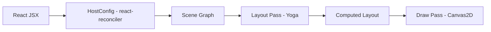

# react-canvas-fiber

[English Version](../README.md)

参考 react-three-fiber 的思路实现一个 Canvas 自定义 React Renderer：用 JSX 声明图元树，React 负责 diff，renderer 维护 scene graph，并在每次提交后执行 `layout -> draw` 渲染到 `<canvas>`。

## 目录结构

- 核心库（可打包分发）：[packages/react-canvas-fiber](../packages/react-canvas-fiber)
- Demo 应用（Vite + React）：[apps/demo](../apps/demo)
- 文档站点（dumi）：[apps/dumi-docs](../apps/dumi-docs)
- DevTools 扩展（Chrome）：[apps/devtools-extension](../apps/devtools-extension)

## 文档

- 文档站点源码：[apps/dumi-docs/docs](../apps/dumi-docs/docs)
- DevTools 指南：[devtools.md](../apps/dumi-docs/docs/guide/devtools.md)
- 架构说明：[ARCHITECTURE.md](./ARCHITECTURE.md)（[English](./ARCHITECTURE.en.md)）

## 快速开始

前置：Node.js + pnpm

```bash
pnpm install
pnpm dev
```

构建全部工作区（核心库 + demo）：

```bash
pnpm build
```

本地启动文档站点：

```bash
pnpm -C apps/dumi-docs dev
```

## DevTools 面板

提供一个 Chrome DevTools 面板用于查看场景树/节点高亮/属性检查：

- 文档：[apps/dumi-docs/docs/guide/devtools.md](../apps/dumi-docs/docs/guide/devtools.md)
- 扩展工程：`apps/devtools-extension`

## 使用核心库

核心包名为 `react-canvas-fiber`，demo 里就是以工作区依赖的方式使用它：

发布到 npm 后可直接安装：

```bash
pnpm add react-canvas-fiber
```

```tsx
import { Canvas, Rect, Text, View } from '@jiujue/react-canvas-fiber'

export function Example() {
	return (
		<Canvas width={600} height={400} dpr={devicePixelRatio} clearColor="#0b1020">
			<View style={{ width: 600, height: 400, padding: 16, flexDirection: 'column', gap: 12 }}>
				<Text
					text="Hello Canvas Renderer"
					style={{ fontSize: 24, fontWeight: 700 }}
					color="#e6edf7"
				/>
				<Rect style={{ width: 180, height: 44 }} borderRadius={10} fill="#2b6cff" />
			</View>
		</Canvas>
	)
}
```

## 架构概览

### 渲染管线



### 关键模块

- 场景树与节点结构：`packages/react-canvas-fiber/src/runtime/nodes.ts`
- reconciler HostConfig：`packages/react-canvas-fiber/src/runtime/reconciler.ts`
- Yoga style 映射与 layout pass：`packages/react-canvas-fiber/src/layout/layoutTree.ts`
- Canvas2D 绘制：`packages/react-canvas-fiber/src/render/drawTree.ts`
- React DOM 桥接组件 `<Canvas/>`：`packages/react-canvas-fiber/src/components/Canvas.tsx`

## 设计目标（第一版）

- 支持 `View/Rect/Text` 这类 JSX 节点，React diff 后能触发重绘
- 支持 Yoga Flexbox 子集布局：宽高、flexDirection、justifyContent、alignItems、padding/margin、position、gap
- 使用 `requestAnimationFrame` 合帧：一次提交内多次更新只渲染一帧

## 说明

- 当前实现是“最小可用骨架”，绘制能力与布局能力都是子集，便于后续扩展（例如 Group/Transform、更多图元、事件系统、useFrame 等）。

## 参与贡献

见 [CONTRIBUTING.md](../CONTRIBUTING.md)。

## License

MIT，见 [LICENSE](../LICENSE)。
