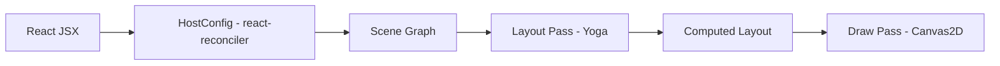

# @jiujue/react-canvas-fiber

[English Version](../README.md)

**基于 HTML5 Canvas 的高性能 React 自定义渲染器，集成 Yoga Layout 以支持 Flexbox 布局。**

> 受 react-three-fiber 启发，本项目将 React 的声明式能力和 CSS Flexbox 的布局能力带入了 Canvas 2D 上下文。

**关键词**: react, canvas, renderer, fiber, yoga, layout, flexbox, 2d, ui, graphics

## ✨ 特性

- **React 声明式 UI**: 使用标准的 JSX 编写 Canvas 场景。
- **Flexbox 布局**: 由 [Yoga](https://yogalayout.com/) 驱动的完整布局系统（支持 `flex`, `padding`, `margin`, `gap` 等）。
- **高性能**: 基于 `requestAnimationFrame` 的批量更新，仅在必要时重绘。
- **事件系统**: 类 DOM 的事件冒泡与捕获机制（支持 `onClick`, `onPointerOver` 等）。
- **开发体验**: 提供专属的 Chrome DevTools 扩展，用于调试场景图。

## 📦 安装

```bash
pnpm add @jiujue/react-canvas-fiber
```

> **注意**: 本渲染器需要 **React 18**。

## 🚀 使用

```tsx
import { Canvas, Image, Rect, Text, View } from '@jiujue/react-canvas-fiber'

export function App() {
	return (
		<Canvas
			width={800}
			height={600}
			style={{ border: '1px solid #ccc' }}
			dpr={window.devicePixelRatio}
		>
			<View
				style={{
					flex: 1,
					justifyContent: 'center',
					alignItems: 'center',
					gap: 20,
					background: '#0b1020',
				}}
			>
				<Text text="Hello Canvas!" style={{ fontSize: 32, fontWeight: 'bold' }} color="#e6edf7" />
				<Rect style={{ width: 100, height: 100 }} fill="#2b6cff" borderRadius={12} />
				<Image
					src="https://example.com/image.png"
					style={{ width: 80, height: 80 }}
					objectFit="cover"
					borderRadius={40}
				/>
			</View>
		</Canvas>
	)
}
```

## 🛠 本地开发

本项目是一个基于 **pnpm** 的 Monorepo。

**前置要求**: Node.js + pnpm

1. **安装依赖**

   ```bash
   pnpm install
   ```

2. **启动 Demo 应用**

   ```bash
   pnpm dev
   ```

3. **构建所有包**

   ```bash
   pnpm build
   ```

4. **启动文档站点**
   ```bash
   pnpm -C apps/dumi-docs dev
   ```

## 📂 仓库结构

- **`packages/react-canvas-fiber`**: 核心库 ([README](../packages/react-canvas-fiber/README.zh.md))。
- **`apps/demo`**: Vite + React 示例应用，展示功能。
- **`apps/dumi-docs`**: 文档站点 (Dumi)。
- **`apps/devtools-extension`**: Chrome DevTools 扩展源码。

## 📖 文档

- **核心组件**: [Canvas](../packages/react-canvas-fiber/README.zh.md#canvas), [View](../packages/react-canvas-fiber/README.zh.md#view), [Text](../packages/react-canvas-fiber/README.zh.md#text), [Image](../packages/react-canvas-fiber/README.zh.md#image), [Rect](../packages/react-canvas-fiber/README.zh.md#rect)
- **架构概览**: [ARCHITECTURE.md](./ARCHITECTURE.md)
- **DevTools 指南**: [DevTools](../apps/dumi-docs/docs/guide/devtools.md)
- **贡献指南**: [CONTRIBUTING.md](../CONTRIBUTING.md)

## 🏗 架构

渲染器遵循与其他 React 自定义渲染器类似的流水线：



1. **协调 (Reconciliation)**: React diff 虚拟 DOM 并调用 HostConfig 方法。
2. **场景图 (Scene Graph)**: 维护一个轻量级的树结构（`View`, `Text`, `Rect`）。
3. **布局 (Layout)**: Yoga 计算整棵树的布局（x, y, width, height）。
4. **绘制 (Draw)**: 遍历树结构，将元素绘制到 2D 上下文中。

## 🤝 参与贡献

欢迎贡献代码！在提交 Pull Request 之前，请先阅读 [CONTRIBUTING.md](../CONTRIBUTING.md)。

## 📄 许可证

MIT. 详见 [LICENSE](../LICENSE)。
