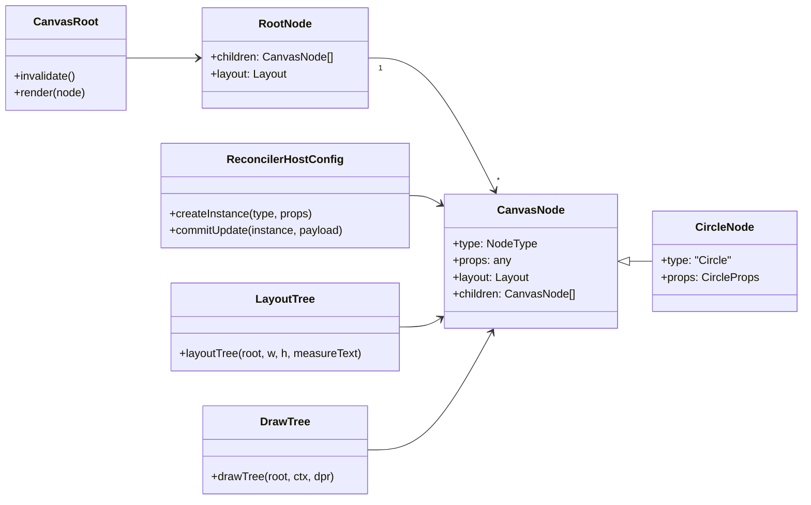
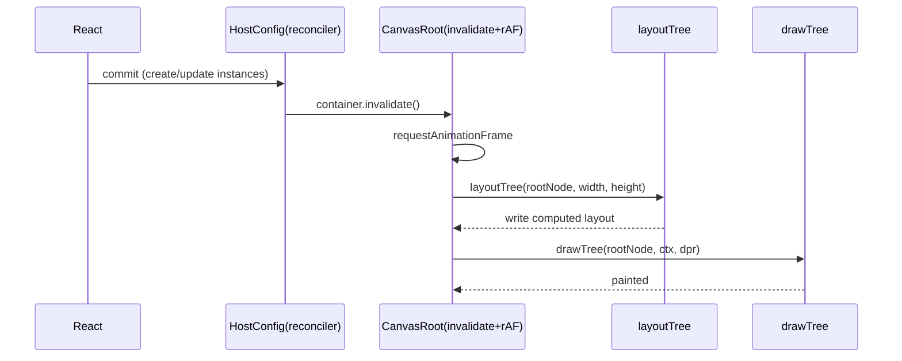
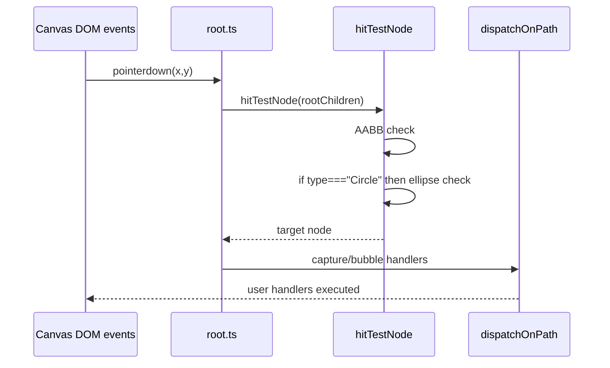

# Circle 功能开发全过程文档（react-canvas-fiber）

- 项目：@jiujue/react-canvas-fiber
- 功能：新增 Circle 节点（渲染 + 事件命中）
- 文档版本：v0.2
- 创建时间：2026-01-29
- 责任人：Trae IDE / AI 结对助手
- 关联代码范围：packages/react-canvas-fiber/src, apps/demo/src, apps/dumi-docs/docs, apps/dumi-docs/.dumirc.ts

## 1. 构思阶段记录

### 1.1 核心需求

在现有 JSX 节点（View / Rect / Text / Image）的基础上，新增一个语义化的图元节点：

- 支持 `<Circle />` 作为 intrinsic element 被 reconciler 创建为场景树节点
- 支持 Yoga 布局（通过 style.width / style.height 等参与布局）
- 支持 Canvas2D 绘制（填充 fill、描边 stroke、线宽 lineWidth）
- 支持事件命中（pointer/click 等）与现有事件派发链路一致

### 1.2 业务价值

- 常用 UI 图元补齐：头像占位、状态点、圆形按钮、圆形进度点等
- 提升 DSL 表达力：相比用 Rect + borderRadius 模拟，Circle 语义更清晰，命中更准确
- 为后续图形扩展铺路：Path/Line 等更复杂节点可沿用同一接入流程

### 1.3 技术可行性分析

- 渲染层已有 Rect/Text/Image 分支，可按同模式扩展 [drawTree.ts](../src/render/drawTree.ts)
- 事件命中当前为 AABB（轴对齐包围盒）命中，可对 Circle 增加椭圆命中判定而不破坏其他节点 [root.ts](../src/runtime/root.ts)
- 布局层基于 Yoga，对节点类型无强绑定；只要拥有 style 即可参与布局 [layoutTree.ts](../src/layout/layoutTree.ts)

### 1.4 与其他模块依赖关系

- React Reconciler：创建/更新节点 [reconciler.ts](../src/runtime/reconciler.ts)
- Yoga Layout：为 Circle 计算 x/y/width/height [layoutTree.ts](../src/layout/layoutTree.ts)
- Canvas2D 绘制：根据 layout 绘制椭圆 [drawTree.ts](../src/render/drawTree.ts)
- Pointer 事件系统：命中测试与事件派发 [root.ts](../src/runtime/root.ts)

### 1.5 初步技术方案对比与选择理由

| 方案                         | 描述                              | 优点                                 | 缺点                                       | 结论     |
| ---------------------------- | --------------------------------- | ------------------------------------ | ------------------------------------------ | -------- |
| A：Rect + borderRadius 模拟  | 用 `<Rect borderRadius={9999} />` | 不新增节点                           | 语义不清晰；命中仍是矩形；需要用户心智约束 | 不选     |
| B：新增 Circle 节点（本次）  | `<Circle />` 独立图元             | 语义清晰；可做椭圆命中；扩展路径清晰 | 需要新增类型/导出/绘制/命中分支            | 选择     |
| C：新增 Path 节点替代 Circle | 用 Path2D 画圆                    | 一般性强                             | 对“圆形”常用场景过重；API 更复杂           | 后续再做 |

## 2. 设计阶段文档

### 2.1 架构设计决策摘要

- Circle 作为 intrinsic element，走同一 reconciler mutation 路径，不引入新 runtime 子系统
- 布局依然由 Yoga 输出宽高，Circle 的半径由最终布局尺寸推导（rx = w/2, ry = h/2）
- 命中测试：在通过 AABB 初筛后，对 Circle 执行“归一化椭圆方程”判定
- 不引入第三方库、不新增绘制缓存策略，保持实现最小

### 2.2 类图（简化）

### 2.3 时序图：一次 React 更新到画布呈现

### 2.4 时序图：Pointer 命中与派发（Circle 特化）

### 2.5 接口定义（对外 API）

- JSX：`<Circle />` intrinsic element（由导出的 `Circle()` 包装函数创建）
- Props：`CircleProps`（与 RectProps 保持同等事件能力，填充/描边参数一致）

关联定义：

- [types/jsx.ts](../src/types/jsx.ts)
- [intrinsics.d.ts](../src/intrinsics.d.ts)
- [src/index.ts](../src/index.ts)

### 2.6 数据结构设计

- `NodeType`：新增 `'Circle'`
- `CircleNode`：`BaseNode<'Circle', CircleProps>`
- `CanvasNode` 联合类型：纳入 `CircleNode`

定义位置：

- [types/nodes.ts](../src/types/nodes.ts)

### 2.7 算法选择与正确性

#### 绘制算法

- 使用 `ctx.ellipse(cx, cy, rx, ry, 0, 0, 2π)`
- 参数推导：`cx = x + w/2`, `cy = y + h/2`, `rx = w/2`, `ry = h/2`
- 填充与描边策略与 Rect 一致：先 fill，再 stroke

实现位置：

- [drawTree.ts](../src/render/drawTree.ts)

#### 命中算法

1. AABB 初筛：命中范围限定在 layout 矩形内
2. 椭圆判定（归一化）：  
   `dx = (x - cx) / rx`  
   `dy = (y - cy) / ry`  
   命中条件：`dx^2 + dy^2 <= 1`

实现位置：

- [root.ts](../src/runtime/root.ts)

### 2.8 性能考虑

- 渲染分支为 O(1)，不增加树遍历复杂度
- 命中测试增加常数级计算，仅在 AABB 命中后执行
- 未引入离屏缓存/Path2D 缓存，保持实现最小；后续如有大量 Circle 可再引入缓存策略

### 2.9 扩展性设计（下一步可演进点）

- Circle 支持 “半径优先” API：`r`/`rx`/`ry` 与 style.width/height 的协同规则
- 支持 `strokeDasharray`、`opacity`、`shadow*` 等绘制属性
- 支持 `clipPath` 或与 View 的圆角裁剪交互

## 3. 代码实现追踪

### 3.1 变更批次日志（未进行 git commit，按开发批次记录）

#### 变更批次 #1（2026-01-29）

- 新增：`CircleProps`
  - 文件：[jsx.ts](../src/types/jsx.ts)
  - 原因：对齐 Rect 的 fill/stroke/lineWidth 与事件 props
  - 影响范围：类型系统、JSX intrinsic 定义

- 新增：`NodeType` 增加 `'Circle'`，并新增 `CircleNode`、更新 `CanvasNode` 联合类型
  - 文件：[nodes.ts](../src/types/nodes.ts)
  - 原因：运行时与绘制层需要可区分 Circle 分支
  - 影响范围：所有引用 NodeType/CanvasNode 的模块

- 更新：对外类型导出
  - 文件：[types/index.ts](../src/types/index.ts)
  - 原因：让用户侧可直接 import CircleProps 等类型

- 更新：intrinsic elements 注册 Circle
  - 文件：[intrinsics.d.ts](../src/intrinsics.d.ts)
  - 原因：让 TS 能识别 `<Circle />`

- 更新：JSX 包装组件与入口导出
  - 文件：[jsx/index.ts](../src/jsx/index.ts)、[index.ts](../src/index.ts)
  - 原因：对齐 View/Rect/Text/Image 的使用方式

- 新增：Circle 绘制分支
  - 文件：[drawTree.ts](../src/render/drawTree.ts)
  - 原因：Canvas2D 需要绘制椭圆

- 新增：Circle 命中测试分支
  - 文件：[root.ts](../src/runtime/root.ts)
  - 原因：Rect 命中为 AABB，Circle 需要椭圆命中精度

- 集成示例：demo 增加 Circle 展示块
  - 文件：[FeatureDemo.tsx](../..//apps/demo/src/demos/FeatureDemo.tsx)
  - 原因：提供肉眼可见的集成回归点

#### 变更批次 #2（2026-01-29）

- 文档：dumi 新增 Circle 组件页
  - 文件：[circle.md](../..//apps/dumi-docs/docs/components/circle.md)
  - 原因：补齐 Circle API/示例与可视化预览

- 文档：dumi 侧边栏加入 Circle 与 Image
  - 文件：[.dumirc.ts](../..//apps/dumi-docs/.dumirc.ts)
  - 原因：让新组件与已存在的 Image 出现在导航中

- 文档：Getting Started 示例与概念说明补充 Circle
  - 文件：[getting-started.md](../..//apps/dumi-docs/docs/guide/getting-started.md)
  - 原因：入口文档与能力集合保持一致

- 文档：Events 支持列表补充 Circle
  - 文件：[events.md](../..//apps/dumi-docs/docs/guide/events.md)
  - 原因：事件能力覆盖所有可交互图元

- 文档：类型页补充 CircleProps 与导出列表
  - 文件：[index.md](../..//apps/dumi-docs/docs/types/index.md)
  - 原因：对外类型与源码导出保持同步

#### 变更批次 #3（2026-01-29）

- 文档：Image 组件页修复示例图片资源失效
  - 文件：[image.md](../..//apps/dumi-docs/docs/components/image.md)
  - 原因：原示例图片外链不可用，导致页面只展示文字；替换为稳定的公开图片源（Unsplash）

### 3.2 测试用例记录

#### 单元测试（类型/接口约束）

- 用例：NodeType 必须包含 'Circle'
- 用例：CircleProps 必须包含 style 字段（可选）
- 用例：Circle JSX 包装函数的参数类型必须为 CircleProps

实现位置：

- [circle.types.test.ts](../tests/circle.types.test.ts)
- 配套编译配置：[tsconfig.test.json](../tsconfig.test.json)

#### 集成用例（demo 构建 + 运行）

- 用例：apps/demo 构建时能正确引用并导入 Circle
- 用例：FeatureDemo 页面渲染出 Circle（绿底白描边）

实现位置：

- [FeatureDemo.tsx](../..//apps/demo/src/demos/FeatureDemo.tsx)

## 4. 架构影响分析

### 4.1 性能影响

- 渲染：新增一个 `if (node.type === 'Circle')` 分支，常数开销
- 命中：在 AABB 通过后增加椭圆判定，常数开销

### 4.2 内存使用变化

- 节点对象增加一种联合类型，不引入额外 runtime 字段（Circle 无 imageInstance 等）
- YogaNode 与现有节点一致按需创建，无额外 WASM 释放逻辑改动

### 4.3 API 兼容性

- 向后兼容：对现有 View/Rect/Text/Image 无破坏
- 向前扩展：新增导出 `Circle` 与 `CircleProps`，属于增量 API

### 4.4 数据库 schema 变更

- 无（该项目不涉及 DB）

### 4.5 第三方库依赖更新

- 无新增依赖；沿用 Canvas2D、react-reconciler、yoga-layout

### 4.6 潜在需要重构的模块清单

- 若后续引入 Path/Line 等图元，建议抽象 hitTest 策略表（按 type 分发），避免 root.ts 过长
- 若 Circle 数量很大且重绘频繁，可引入 Path2D 缓存或离屏缓存策略

## 5. 文档同步更新记录

本次新增了对外 API（Circle），同步更新了 dumi 站点文档与 demo 示例，并在此处记录文档变更与版本。

| 时间       | 文档              | 更新内容                                                | 责任人        | 版本 |
| ---------- | ----------------- | ------------------------------------------------------- | ------------- | ---- |
| 2026-01-29 | CIRCLE_DEV_DOC.md | 首次交付：需求、设计、变更、测试、操作模板              | Trae IDE / AI | v0.1 |
| 2026-01-29 | dumi-docs 站点    | 新增 Circle 组件页；更新侧边栏、Getting Started、类型页 | Trae IDE / AI | v0.2 |
| 2026-01-29 | demo 示例         | FeatureDemo 增加 Circle 展示与说明文本                  | Trae IDE / AI | v0.2 |
| 2026-01-29 | dumi-docs 站点    | 修复 Image 组件页示例图片外链失效（替换为 Unsplash）    | Trae IDE / AI | v0.2 |

## 6. 操作记录规范（模板 + 本次实例）

### 6.1 标准化记录模板

| 字段       | 说明                                                   |
| ---------- | ------------------------------------------------------ |
| 操作时间   | YYYY-MM-DD HH:mm:ss（本地时区）                        |
| 操作人员   | 姓名/角色                                              |
| 操作类型   | 环境搭建 / 代码修改 / 配置修改 / 测试 / 修复 / 发布 等 |
| 操作目标   | 本次操作要达成的结果                                   |
| 操作步骤   | 按顺序列出（可含命令与文件路径）                       |
| 操作结果   | 成功/失败 + 关键输出                                   |
| 问题与解决 | 遇到的问题、定位过程、解决方案                         |
| 影响范围   | 受影响模块、潜在风险                                   |
| 关联记录   | 关联 PR/issue/变更批次编号/文档版本                    |

### 6.2 本次开发操作实例（摘录）

| 操作时间   | 操作人员      | 操作类型         | 操作步骤                                         | 操作结果         |
| ---------- | ------------- | ---------------- | ------------------------------------------------ | ---------------- |
| 2026-01-29 | Trae IDE / AI | 代码修改         | 新增 CircleProps/NodeType/Circle 渲染与命中/导出 | 已完成并通过构建 |
| 2026-01-29 | Trae IDE / AI | 构建             | `pnpm -C packages/react-canvas-fiber build`      | exit 0           |
| 2026-01-29 | Trae IDE / AI | 单元测试（类型） | `pnpm -C packages/react-canvas-fiber test:types` | exit 0           |
| 2026-01-29 | Trae IDE / AI | 集成构建         | `pnpm -C apps/demo build`                        | exit 0           |
| 2026-01-29 | Trae IDE / AI | 文档构建         | `pnpm -C apps/dumi-docs build`                   | exit 0           |
| 2026-01-29 | Trae IDE / AI | 代码规范         | `pnpm lint`                                      | exit 0           |
