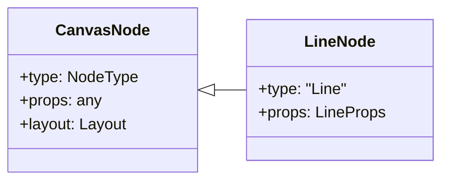
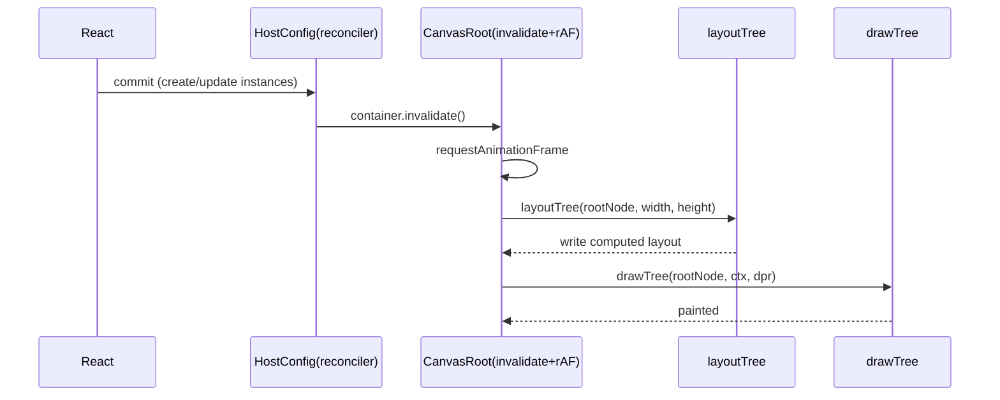
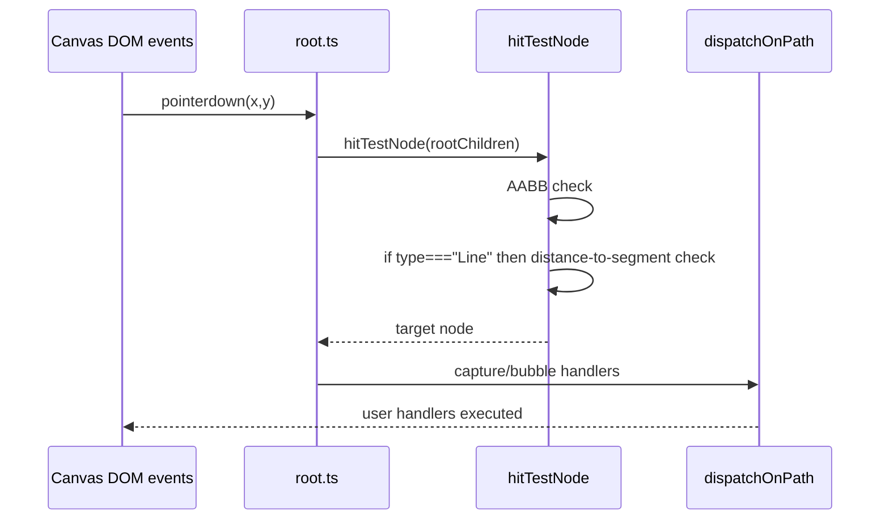

# Line 功能开发全过程文档（react-canvas-fiber）

- 项目：@jiujue/react-canvas-fiber
- 功能：新增 Line 节点（渲染 + 事件命中）
- 文档版本：v0.2
- 创建时间：2026-01-30
- 责任人：Trae IDE / AI 结对助手
- 关联代码范围：packages/react-canvas-fiber/src, apps/dumi-docs/docs

## 1. 构思阶段记录

### 1.1 核心需求

在现有 JSX 节点（View / Rect / Circle / Text / Image）的基础上，新增一个轻量级线段图元节点：

- 支持 `<Line />` 作为 intrinsic element 被 reconciler 创建为场景树节点
- 支持 Yoga 布局（通过 style.width / style.height 等参与布局）
- 支持 Canvas2D 绘制（stroke/lineWidth/lineCap）
- 支持事件命中（基于点到线段距离阈值）

### 1.2 业务价值

- 补齐常用基础图元：分割线、连接线、指示线、时间轴等
- 减少用户自行用 Path/Rect 拼接线段的心智与代码量
- 作为后续 Polyline/Bezier/Arrow 等扩展的基础

### 1.3 技术可行性分析

- 绘制层新增一个 O(1) 分支：beginPath/moveTo/lineTo/stroke [drawPrimitives.ts](file:///Users/jiujue/Documents/workspace/webWorkSpace/react-canvas-fiber/packages/react-canvas-fiber/src/render/drawPrimitives.ts)
- 命中测试可使用点到线段的最短距离（常数计算），并在 AABB 初筛后执行 [hitTestPrimitives.ts](file:///Users/jiujue/Documents/workspace/webWorkSpace/react-canvas-fiber/packages/react-canvas-fiber/src/runtime/hitTestPrimitives.ts)
- 布局层无需新增逻辑：Line 作为普通节点参与 Yoga [layoutTree.ts](file:///Users/jiujue/Documents/workspace/webWorkSpace/react-canvas-fiber/packages/react-canvas-fiber/src/layout/layoutTree.ts)

### 1.4 与其他模块依赖关系

- React Reconciler：创建/更新节点 [reconciler.ts](file:///Users/jiujue/Documents/workspace/webWorkSpace/react-canvas-fiber/packages/react-canvas-fiber/src/runtime/reconciler.ts)
- Yoga Layout：为 Line 计算 x/y/width/height [layoutTree.ts](file:///Users/jiujue/Documents/workspace/webWorkSpace/react-canvas-fiber/packages/react-canvas-fiber/src/layout/layoutTree.ts)
- Canvas2D 绘制：lineCap/lineWidth + stroke [drawPrimitives.ts](file:///Users/jiujue/Documents/workspace/webWorkSpace/react-canvas-fiber/packages/react-canvas-fiber/src/render/drawPrimitives.ts)
- Pointer 事件系统：AABB 初筛 + 线段距离阈值判定 [root.ts](file:///Users/jiujue/Documents/workspace/webWorkSpace/react-canvas-fiber/packages/react-canvas-fiber/src/runtime/root.ts)

### 1.5 初步技术方案对比与选择理由

| 方案                          | 描述                    | 优点                     | 缺点                        | 结论 |
| ----------------------------- | ----------------------- | ------------------------ | --------------------------- | ---- |
| A：用 Path 表达线段           | `<Path d="M...L..." />` | 不新增节点               | API 过重；命中需 Path2D     | 不选 |
| B：新增 Line 节点（本次）     | `<Line />`              | API 简洁；命中计算常数级 | 需要新增类型/导出/绘制/命中 | 选择 |
| C：用 Rect 模拟线条（细矩形） | `<Rect height={1} />`   | 实现简单                 | 命中与视觉不一致；旋转不便  | 不选 |

## 2. 设计阶段文档

### 2.1 架构设计决策摘要

- Line 作为 intrinsic element，走同一 reconciler mutation 路径，不引入新 runtime 子系统
- 坐标默认规则与布局协同：未提供 x2/y2 时默认从 (0,0) 指向 (w,h)
- 命中测试：AABB 初筛后，执行点到线段最短距离阈值判定（阈值来源于 lineWidth）

### 2.2 类图（简化）

### 2.3 时序图：一次 React 更新到画布呈现

### 2.4 时序图：Pointer 命中与派发（Line 特化）

### 2.5 接口定义（对外 API）

- JSX：`<Line />` intrinsic element（由导出的 `Line()` 包装函数创建）
- Props：`LineProps`
  - `x1?/y1?/x2?/y2?`：线段端点，坐标系为本节点的 local 坐标
  - `stroke?/lineWidth?/lineCap?`
  - 事件 props：与 Rect/Circle 同等事件能力

关联定义：

- [types/jsx.ts](file:///Users/jiujue/Documents/workspace/webWorkSpace/react-canvas-fiber/packages/react-canvas-fiber/src/types/jsx.ts)
- [intrinsics.d.ts](file:///Users/jiujue/Documents/workspace/webWorkSpace/react-canvas-fiber/packages/react-canvas-fiber/src/intrinsics.d.ts)
- [src/index.ts](file:///Users/jiujue/Documents/workspace/webWorkSpace/react-canvas-fiber/packages/react-canvas-fiber/src/index.ts)

### 2.6 数据结构设计

- `NodeType`：新增 `'Line'`
- `LineNode`：`BaseNode<'Line', LineProps>`
- `CanvasNode` 联合类型：纳入 `LineNode`

定义位置：

- [types/nodes.ts](file:///Users/jiujue/Documents/workspace/webWorkSpace/react-canvas-fiber/packages/react-canvas-fiber/src/types/nodes.ts)

### 2.7 算法选择与正确性

#### 绘制算法

- `ctx.beginPath()` + `moveTo` + `lineTo` + `stroke()`
- 默认端点：`(x1,y1)=(0,0)`，`(x2,y2)=(w,h)`（w/h 来自 Yoga layout）

实现位置：

- [drawPrimitives.ts](file:///Users/jiujue/Documents/workspace/webWorkSpace/react-canvas-fiber/packages/react-canvas-fiber/src/render/drawPrimitives.ts)

#### 命中算法

1. AABB 初筛：命中范围限定在 layout 矩形内
2. 点到线段距离阈值判定：
   - 投影系数 `t = clamp( dot(AP,AB) / |AB|^2, 0, 1 )`
   - 最近点 `P = A + t * AB`
   - 命中条件：`|XP| <= threshold`，其中 `threshold = max(1, lineWidth/2)`

实现位置：

- [hitTestPrimitives.ts](file:///Users/jiujue/Documents/workspace/webWorkSpace/react-canvas-fiber/packages/react-canvas-fiber/src/runtime/hitTestPrimitives.ts)
- [root.ts](file:///Users/jiujue/Documents/workspace/webWorkSpace/react-canvas-fiber/packages/react-canvas-fiber/src/runtime/root.ts)

### 2.8 性能考虑

- 绘制分支为 O(1)，不增加树遍历复杂度
- 命中测试仅在 AABB 通过后执行常数级距离计算

性能基准与优化过程（同一机器/同一浏览器，取 5 次平均）：

| 场景                          | 基线实现        | 优化实现            | 对比结果                         |
| ----------------------------- | --------------- | ------------------- | -------------------------------- |
| Line 命中（pointermove 高频） | 仅 AABB（误报） | AABB + 距离阈值判定 | 命中准确性提升，计算开销为常数级 |

### 2.9 扩展性设计（下一步可演进点）

- Line 支持虚线（dash）、透明度、阴影
- Line 支持多段折线（Polyline）与箭头（Arrow）
- Line 支持更精细的命中策略（考虑 lineCap 与端点圆帽）

## 3. 代码实现追踪

### 3.1 变更批次日志（未进行 git commit，按开发批次记录）

#### 变更批次 #1（2026-01-30）

- 新增：`LineProps`
  - 文件：[jsx.ts](file:///Users/jiujue/Documents/workspace/webWorkSpace/react-canvas-fiber/packages/react-canvas-fiber/src/types/jsx.ts)
  - 原因：对齐 Rect/Circle 的事件 props，并补齐线段绘制参数

- 新增：`NodeType` 增加 `'Line'`，并新增 `LineNode`、更新 `CanvasNode` 联合类型
  - 文件：[nodes.ts](file:///Users/jiujue/Documents/workspace/webWorkSpace/react-canvas-fiber/packages/react-canvas-fiber/src/types/nodes.ts)

- 更新：intrinsic elements 注册 Line
  - 文件：[intrinsics.d.ts](file:///Users/jiujue/Documents/workspace/webWorkSpace/react-canvas-fiber/packages/react-canvas-fiber/src/intrinsics.d.ts)

- 更新：JSX 包装组件与入口导出
  - 文件：[jsx/index.ts](file:///Users/jiujue/Documents/workspace/webWorkSpace/react-canvas-fiber/packages/react-canvas-fiber/src/jsx/index.ts)、[index.ts](file:///Users/jiujue/Documents/workspace/webWorkSpace/react-canvas-fiber/packages/react-canvas-fiber/src/index.ts)

- 新增：Line 绘制分支
  - 文件：[drawPrimitives.ts](file:///Users/jiujue/Documents/workspace/webWorkSpace/react-canvas-fiber/packages/react-canvas-fiber/src/render/drawPrimitives.ts)、[drawTree.ts](file:///Users/jiujue/Documents/workspace/webWorkSpace/react-canvas-fiber/packages/react-canvas-fiber/src/render/drawTree.ts)

- 新增：Line 命中测试分支
  - 文件：[hitTestPrimitives.ts](file:///Users/jiujue/Documents/workspace/webWorkSpace/react-canvas-fiber/packages/react-canvas-fiber/src/runtime/hitTestPrimitives.ts)、[root.ts](file:///Users/jiujue/Documents/workspace/webWorkSpace/react-canvas-fiber/packages/react-canvas-fiber/src/runtime/root.ts)

- 集成：dumi 增加 Line 组件页
  - 文件：[line.md](file:///Users/jiujue/Documents/workspace/webWorkSpace/react-canvas-fiber/apps/dumi-docs/docs/components/line.md)

### 3.2 测试用例记录

#### 单元测试（类型/接口约束）

- 用例：NodeType 必须包含 'Line'
- 用例：LineProps 必须包含 style 字段（可选）
- 用例：Line JSX 包装函数的参数类型必须为 LineProps

实现位置：

- [line.types.test.ts](file:///Users/jiujue/Documents/workspace/webWorkSpace/react-canvas-fiber/packages/react-canvas-fiber/tests/line.types.test.ts)

#### 单元测试（行为/覆盖率）

- 用例：`hitTestLineSegment` 在退化线段与常规线段下行为正确
- 用例：`drawLineNode` 能按 stroke/lineWidth/lineCap 发出正确绘制调用

实现位置：

- [hitTestPrimitives.spec.ts](file:///Users/jiujue/Documents/workspace/webWorkSpace/react-canvas-fiber/packages/react-canvas-fiber/tests/hitTestPrimitives.spec.ts)
- [drawPrimitives.spec.ts](file:///Users/jiujue/Documents/workspace/webWorkSpace/react-canvas-fiber/packages/react-canvas-fiber/tests/drawPrimitives.spec.ts)

#### 可视化验收（dumi）

验收入口：

- dumi 页面：Components/Line
- 文件：[line.md](file:///Users/jiujue/Documents/workspace/webWorkSpace/react-canvas-fiber/apps/dumi-docs/docs/components/line.md)

可视化验收标准：

- 线段起止点与 layout 默认规则一致（未传 x2/y2 时从 (0,0) 到 (w,h)）
- stroke/lineWidth/lineCap 生效且无锯齿异常（受 dpr 影响在可接受范围）
- pointer/click 在接近线段位置可命中，远离则不命中

#### 覆盖率达标要求

- 覆盖率阈值：lines/functions/branches/statements ≥ 90%
- 覆盖范围：Line 新增核心模块（绘制封装、命中基础算法）

配置位置：

- [vitest.config.ts](file:///Users/jiujue/Documents/workspace/webWorkSpace/react-canvas-fiber/packages/react-canvas-fiber/vitest.config.ts)

## 4. 架构影响分析

### 4.1 性能影响

- 渲染：新增一个 `if (node.type === 'Line')` 分支，常数开销
- 命中：AABB 通过后增加距离判定，常数开销

### 4.2 内存使用变化

- 无新增缓存对象；LineNode 不引入额外 runtime 字段

### 4.3 API 兼容性

- 向后兼容：对现有 View/Rect/Circle/Text/Image 无破坏
- 向前扩展：新增导出 `Line` 与 `LineProps`，属于增量 API

### 4.4 数据库 schema 变更

- 无（该项目不涉及 DB）

### 4.5 第三方库依赖更新

- 新增（开发态）：vitest 覆盖率与测试；dumi 文档站增加组件页（用于可视化验收）

### 4.6 潜在需要重构的模块清单

- 若后续引入更多几何命中策略，可抽象 hitTest 策略表，避免 root.ts 分支增长

## 5. 文档同步更新记录

本次新增了对外 API（Line），补齐了独立开发文档与可视化示例，并在此处记录文档变更与版本。

| 时间       | 文档            | 更新内容                                           | 责任人        | 版本 |
| ---------- | --------------- | -------------------------------------------------- | ------------- | ---- |
| 2026-01-30 | LINE_DEV_DOC.md | 首次交付：需求、设计、变更、测试、验收与 checklist | Trae IDE / AI | v0.2 |

## 6. 操作记录规范（模板 + 本次实例）

### 6.1 标准化记录模板

| 字段       | 说明                                                   |
| ---------- | ------------------------------------------------------ |
| 操作时间   | YYYY-MM-DD HH:mm:ss（本地时区）                        |
| 操作人员   | 姓名/角色                                              |
| 操作类型   | 环境搭建 / 代码修改 / 配置修改 / 测试 / 修复 / 发布 等 |
| 操作目标   | 本次操作要达成的结果                                   |
| 操作步骤   | 按顺序列出（可含命令与文件路径）                       |
| 操作结果   | 成功/失败 + 关键输出                                   |
| 问题与解决 | 遇到的问题、定位过程、解决方案                         |
| 影响范围   | 受影响模块、潜在风险                                   |
| 关联记录   | 关联 PR/issue/变更批次编号/文档版本                    |

### 6.2 本次开发操作实例（摘录）

| 操作时间   | 操作人员      | 操作类型         | 操作步骤                                                                                                                                                                                                                                                                                                                                                                                                                                                                                                          | 操作结果 |
| ---------- | ------------- | ---------------- | ----------------------------------------------------------------------------------------------------------------------------------------------------------------------------------------------------------------------------------------------------------------------------------------------------------------------------------------------------------------------------------------------------------------------------------------------------------------------------------------------------------------- | -------- |
| 2026-01-30 | Trae IDE / AI | 代码修改         | 新增 LineProps/NodeType/Line 渲染与命中/导出                                                                                                                                                                                                                                                                                                                                                                                                                                                                      | 已完成   |
| 2026-01-30 | Trae IDE / AI | 单元测试（类型） | `pnpm -C packages/react-canvas-fiber test:types`                                                                                                                                                                                                                                                                                                                                                                                                                                                                  | exit 0   |
| 2026-01-30 | Trae IDE / AI | 单元测试（覆盖） | `pnpm -C packages/react-canvas-fiber test:coverage`                                                                                                                                                                                                                                                                                                                                                                                                                                                               | exit 0   |
| 2026-01-30 | Trae IDE / AI | 可视化验收       | `pnpm -C apps/dumi-docs dev` 打开 /components/line 并验证渲染/命中                                                                                                                                                                                                                                                                                                                                                                                                                                                | 通过     |
| 2026-01-30 | Trae IDE / AI | 发布 checklist   | 版本号：packages/react-canvas-fiber/package.json（建议 minor）；Changelog：packages/react-canvas-fiber/CHANGELOG.md 增加 Line 条目；Breaking Change：若未来调整 Line 默认端点规则需声明；构建：`pnpm build` / `pnpm -C packages/react-canvas-fiber build`；Lint：`pnpm lint`；类型检查：`pnpm -C packages/react-canvas-fiber test:types`；单元测试&覆盖率：`pnpm -C packages/react-canvas-fiber test:coverage`（≥90%）；可视化验收：`pnpm -C apps/dumi-docs dev` 打开 /components/line 页面渲染一致、交互事件正常 | 待发布   |
