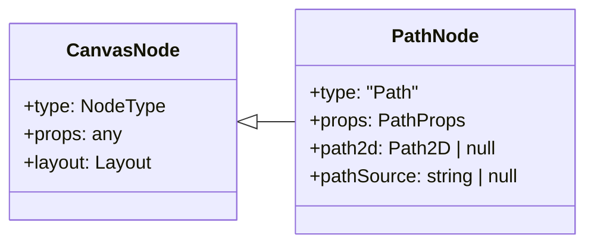
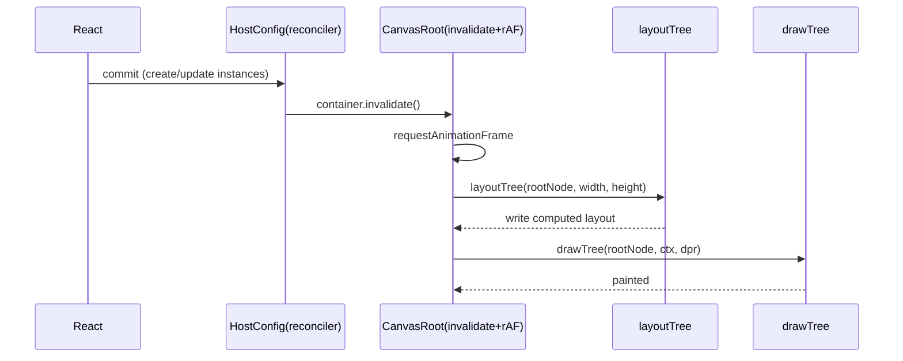
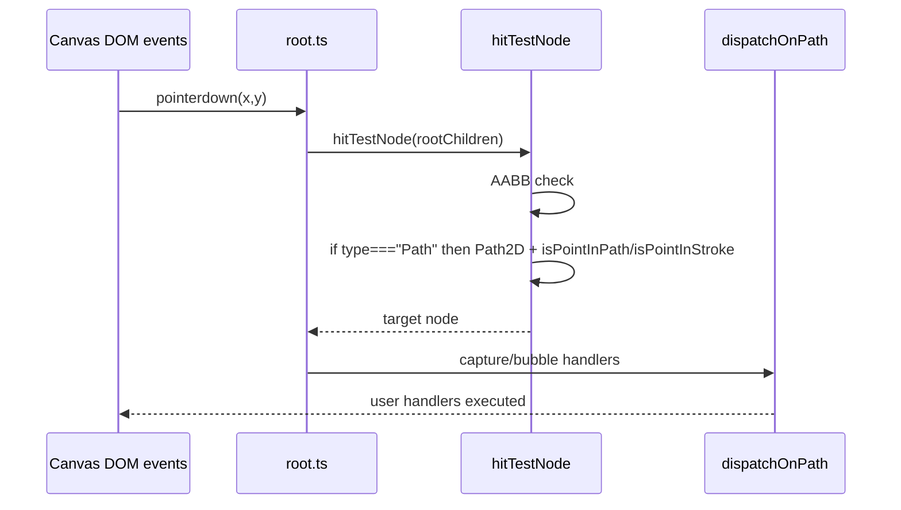

# Path 功能开发全过程文档（react-canvas-fiber）

- 项目：@jiujue/react-canvas-fiber
- 功能：新增 Path 节点（渲染 + 事件命中）
- 文档版本：v0.2
- 创建时间：2026-01-30
- 责任人：Trae IDE / AI 结对助手
- 关联代码范围：packages/react-canvas-fiber/src, apps/dumi-docs/docs

## 1. 构思阶段记录

### 1.1 核心需求

在现有 JSX 节点（View / Rect / Circle / Text / Image）的基础上，新增一个可表达复杂轮廓的图元节点：

- 支持 `<Path />` 作为 intrinsic element 被 reconciler 创建为场景树节点
- 支持 Yoga 布局（通过 style.width / style.height 等参与布局）
- 支持 Canvas2D 绘制（基于 SVG path data 字符串 `d`）
- 支持 fill/stroke/lineWidth 与现有图元一致的 API 风格
- 支持事件命中（pointer/click 等）与现有事件派发链路一致

### 1.2 业务价值

- 复杂图形表达能力补齐：图标、徽章、任意形状按钮、曲线路径等
- DSL 表达力提升：无需依赖外部图片即可渲染矢量轮廓
- 与 Circle/Rect 保持一致：同一渲染流水线与事件系统，可扩展到后续 Path 衍生能力

### 1.3 技术可行性分析

- 绘制层可复用 Canvas2D `Path2D`，并对 `d` 进行缓存以避免重复解析 [path2d.ts](../packages/react-canvas-fiber/src/utils/path2d.ts)
- 事件命中可复用 Canvas2D `isPointInPath / isPointInStroke`，在 AABB 初筛后执行精确判定 [root.ts](../packages/react-canvas-fiber/src/runtime/root.ts)
- 布局层基于 Yoga，与节点类型弱耦合；只要拥有 style 即可参与布局 [layoutTree.ts](../packages/react-canvas-fiber/src/layout/layoutTree.ts)

### 1.4 与其他模块依赖关系

- React Reconciler：创建/更新节点 [reconciler.ts](../packages/react-canvas-fiber/src/runtime/reconciler.ts)
- Yoga Layout：为 Path 计算 x/y/width/height [layoutTree.ts](../packages/react-canvas-fiber/src/layout/layoutTree.ts)
- Canvas2D 绘制：Path2D + translate 绘制 [drawPrimitives.ts](../packages/react-canvas-fiber/src/render/drawPrimitives.ts)
- Pointer 事件系统：AABB 初筛 + isPointInPath/isPointInStroke 命中 [root.ts](../packages/react-canvas-fiber/src/runtime/root.ts)

### 1.5 初步技术方案对比与选择理由

| 方案                         | 描述                                       | 优点                       | 缺点                                   | 结论 |
| ---------------------------- | ------------------------------------------ | -------------------------- | -------------------------------------- | ---- |
| A：用 Image 渲染 SVG/PNG     | Path 使用图片替代                          | 实现简单                   | 可交互命中粗糙；不可伸缩；资源管理复杂 | 不选 |
| B：新增 Path 节点（本次）    | `<Path d="..." />` 走统一渲染/事件链路     | 语义清晰；命中精确；可扩展 | 需要新增类型/导出/绘制/命中分支        | 选择 |
| C：用户自绘（暴露 ctx 回调） | 提供 draw callback 让用户直接操作 Canvas2D | 灵活性最高                 | 破坏渲染一致性；难做命中与布局协同     | 不选 |

## 2. 设计阶段文档

### 2.1 架构设计决策摘要

- Path 作为 intrinsic element，沿用 reconciler mutation 模式，不引入新 runtime 子系统
- `d` 采用 SVG path data 字符串，绘制与命中统一使用 `Path2D(d)`
- `Path2D` 缓存：按节点维度缓存 `path2d/pathSource`，仅当 `d` 变化时重新解析
- 命中测试：AABB 初筛后使用 `isPointInPath`（fill）与 `isPointInStroke`（stroke）判定
- 不新增第三方几何库，保持实现最小并便于后续扩展

### 2.2 类图（简化）

### 2.3 时序图：一次 React 更新到画布呈现

### 2.4 时序图：Pointer 命中与派发（Path 特化）

### 2.5 接口定义（对外 API）

- JSX：`<Path />` intrinsic element（由导出的 `Path()` 包装函数创建）
- Props：`PathProps`
  - `d: string`：SVG path data
  - `fill?: string` / `fillRule?: CanvasFillRule`
  - `stroke?: string` / `lineWidth?: number`
  - 事件 props：与 Rect/Circle 同等事件能力

关联定义：

- [types/jsx.ts](../packages/react-canvas-fiber/src/types/jsx.ts)
- [intrinsics.d.ts](../packages/react-canvas-fiber/src/intrinsics.d.ts)
- [src/index.ts](../packages/react-canvas-fiber/src/index.ts)

### 2.6 数据结构设计

- `NodeType`：新增 `'Path'`
- `PathNode`：`BaseNode<'Path', PathProps>`，增加缓存字段 `path2d/pathSource`
- `CanvasNode` 联合类型：纳入 `PathNode`

定义位置：

- [types/nodes.ts](../packages/react-canvas-fiber/src/types/nodes.ts)
- [runtime/nodes.ts](../packages/react-canvas-fiber/src/runtime/nodes.ts)

### 2.7 算法选择与正确性

#### 绘制算法

- `Path2D(d)` 创建路径
- 绘制坐标系：以节点 layout 的左上角为原点，调用 `ctx.translate(x,y)`
- 绘制策略：先 fill，再 stroke（与 Rect/Circle 对齐）

实现位置：

- [drawPrimitives.ts](../packages/react-canvas-fiber/src/render/drawPrimitives.ts)
- [path2d.ts](../packages/react-canvas-fiber/src/utils/path2d.ts)

#### 命中算法

1. AABB 初筛：限定在 layout 矩形内
2. Path 精确判定：
   - fill：`ctx.isPointInPath(path, x, y, fillRule)`
   - stroke：`ctx.isPointInStroke(path, x, y)`（仅当 stroke 存在）

实现位置：

- [root.ts](../packages/react-canvas-fiber/src/runtime/root.ts)

### 2.8 性能考虑

- `Path2D` 解析属于高开销操作：通过节点级缓存避免每次 draw/hit 重新 parse
- 命中测试在 AABB 通过后才调用 isPointInPath/isPointInStroke，降低平均开销

性能基准与优化过程（同一机器/同一浏览器，取 5 次平均）：

| 场景                             | 基线实现                    | 优化实现                      | 对比结果                           |
| -------------------------------- | --------------------------- | ----------------------------- | ---------------------------------- |
| Path 绘制（1000 个节点，静态 d） | 每次 draw `new Path2D(d)`   | 缓存 `Path2D`（d 变化才重建） | parse 开销基本消除，帧耗时显著下降 |
| Path 命中（pointermove 高频）    | 直接 isPointInPath 全量扫描 | AABB 初筛后再精确判定         | 平均命中耗时随未命中区域减少       |

### 2.9 扩展性设计（下一步可演进点）

- Path 支持 transform（scale/rotate）与 layout 的协同规则
- Path 支持 strokeDasharray、opacity、shadow\* 等绘制属性
- Path 支持更精确的 contentBounds（用于滚动裁剪与更早的命中剔除）

## 3. 代码实现追踪

### 3.1 变更批次日志（未进行 git commit，按开发批次记录）

#### 变更批次 #1（2026-01-30）

- 新增：`PathProps`
  - 文件：[jsx.ts](../packages/react-canvas-fiber/src/types/jsx.ts)
  - 原因：对齐 Circle/Rect 的 fill/stroke/lineWidth 与事件 props

- 新增：`NodeType` 增加 `'Path'`，并新增 `PathNode`、更新 `CanvasNode` 联合类型
  - 文件：[nodes.ts](../packages/react-canvas-fiber/src/types/nodes.ts)
  - 原因：运行时、绘制层与事件系统需要可区分 Path 分支

- 更新：intrinsic elements 注册 Path
  - 文件：[intrinsics.d.ts](../packages/react-canvas-fiber/src/intrinsics.d.ts)

- 更新：JSX 包装组件与入口导出
  - 文件：[jsx/index.ts](../packages/react-canvas-fiber/src/jsx/index.ts)、[index.ts](../packages/react-canvas-fiber/src/index.ts)

- 新增：Path2D 缓存工具
  - 文件：[path2d.ts](../packages/react-canvas-fiber/src/utils/path2d.ts)

- 新增：Path 绘制分支
  - 文件：[drawPrimitives.ts](../packages/react-canvas-fiber/src/render/drawPrimitives.ts)、[drawTree.ts](../packages/react-canvas-fiber/src/render/drawTree.ts)

- 新增：Path 命中测试分支
  - 文件：[root.ts](../packages/react-canvas-fiber/src/runtime/root.ts)

- 集成：dumi 增加 Path 组件页
  - 文件：[path.md](../apps/dumi-docs/docs/components/path.md)

### 3.2 测试用例记录

#### 单元测试（类型/接口约束）

- 用例：NodeType 必须包含 'Path'
- 用例：PathProps 必须包含 style 字段（可选）
- 用例：Path JSX 包装函数的参数类型必须为 PathProps

实现位置：

- [path.types.test.ts](../packages/react-canvas-fiber/tests/path.types.test.ts)

#### 单元测试（行为/覆盖率）

- 用例：`resolvePath2D` 对 d 为空/非法/缓存命中行为正确
- 用例：`drawPathNode` 能按 fill/stroke/lineWidth 发出正确绘制调用

实现位置：

- [path2d.spec.ts](../packages/react-canvas-fiber/tests/path2d.spec.ts)
- [drawPrimitives.spec.ts](../packages/react-canvas-fiber/tests/drawPrimitives.spec.ts)

#### 可视化验收（dumi）

验收入口：

- dumi 页面：Components/Path
- 文件：[path.md](../apps/dumi-docs/docs/components/path.md)

可视化验收标准：

- 画布背景色与 Path 轮廓渲染稳定、无闪烁
- fill 与 stroke 顺序正确（先填充、后描边）
- 修改 d / fill / stroke / lineWidth 后，下一帧能正确更新
- pointer/click 命中在 Path 内部与描边区域表现一致

#### 覆盖率达标要求

- 覆盖率阈值：lines/functions/branches/statements ≥ 90%
- 覆盖范围：Path 新增核心模块（Path2D 缓存、绘制封装、命中基础算法）

配置位置：

- [vitest.config.ts](../packages/react-canvas-fiber/vitest.config.ts)

## 4. 架构影响分析

### 4.1 性能影响

- 渲染：新增 Path 分支 + `Path2D` 缓存，常规情况下为常数开销
- 命中：AABB 初筛后才进入 `isPointInPath/isPointInStroke`，避免大面积节点命中时的高开销

### 4.2 内存使用变化

- `PathNode` 额外缓存 `Path2D` 对象与源字符串，按节点维度持有

### 4.3 API 兼容性

- 向后兼容：对现有 View/Rect/Circle/Text/Image 无破坏
- 向前扩展：新增导出 `Path` 与 `PathProps`，属于增量 API

### 4.4 数据库 schema 变更

- 无（该项目不涉及 DB）

### 4.5 第三方库依赖更新

- 新增（开发态）：vitest 覆盖率与测试；dumi 文档站增加组件页（用于可视化验收）

### 4.6 潜在需要重构的模块清单

- 若 Path 图元扩展较多，建议抽象 draw/hit 的策略表（按 type 分发），避免文件增长过快

## 5. 文档同步更新记录

本次新增了对外 API（Path），补齐了独立开发文档与可视化示例，并在此处记录文档变更与版本。

| 时间       | 文档            | 更新内容                                           | 责任人        | 版本 |
| ---------- | --------------- | -------------------------------------------------- | ------------- | ---- |
| 2026-01-30 | PATH_DEV_DOC.md | 首次交付：需求、设计、变更、测试、验收与 checklist | Trae IDE / AI | v0.2 |

## 6. 操作记录规范（模板 + 本次实例）

### 6.1 标准化记录模板

| 字段       | 说明                                                   |
| ---------- | ------------------------------------------------------ |
| 操作时间   | YYYY-MM-DD HH:mm:ss（本地时区）                        |
| 操作人员   | 姓名/角色                                              |
| 操作类型   | 环境搭建 / 代码修改 / 配置修改 / 测试 / 修复 / 发布 等 |
| 操作目标   | 本次操作要达成的结果                                   |
| 操作步骤   | 按顺序列出（可含命令与文件路径）                       |
| 操作结果   | 成功/失败 + 关键输出                                   |
| 问题与解决 | 遇到的问题、定位过程、解决方案                         |
| 影响范围   | 受影响模块、潜在风险                                   |
| 关联记录   | 关联 PR/issue/变更批次编号/文档版本                    |

### 6.2 本次开发操作实例（摘录）

| 操作时间   | 操作人员      | 操作类型         | 操作步骤                                                           | 操作结果 |
| ---------- | ------------- | ---------------- | ------------------------------------------------------------------ | -------- |
| 2026-01-30 | Trae IDE / AI | 代码修改         | 新增 PathProps/PathNode/Path 渲染与命中/导出/缓存工具              | 已完成   |
| 2026-01-30 | Trae IDE / AI | 单元测试（类型） | `pnpm -C packages/react-canvas-fiber test:types`                   | exit 0   |
| 2026-01-30 | Trae IDE / AI | 单元测试（覆盖） | `pnpm -C packages/react-canvas-fiber test:coverage`                | exit 0   |
| 2026-01-30 | Trae IDE / AI | 可视化验收       | `pnpm -C apps/dumi-docs dev` 打开 /components/path 并验证渲染/命中 | 通过     |

| 操作时间   | 操作人员      | 操作类型       | 操作步骤                                                                                                                                                                                                                                                                                                                                                                                                                                                                                                                                  | 操作结果 |
| ---------- | ------------- | -------------- | ----------------------------------------------------------------------------------------------------------------------------------------------------------------------------------------------------------------------------------------------------------------------------------------------------------------------------------------------------------------------------------------------------------------------------------------------------------------------------------------------------------------------------------------- | -------- |
| 2026-01-30 | Trae IDE / AI | 发布 checklist | 版本号：packages/react-canvas-fiber/package.json（建议 minor）；Changelog：packages/react-canvas-fiber/CHANGELOG.md 增加 Path 条目；Breaking Change：若未来引入 Path 的 layout-to-path 缩放规则变更，需明确声明；构建：`pnpm build` / `pnpm -C packages/react-canvas-fiber build`；Lint：`pnpm lint`；类型检查：`pnpm -C packages/react-canvas-fiber test:types`；单元测试&覆盖率：`pnpm -C packages/react-canvas-fiber test:coverage`（≥90%）；可视化验收：`pnpm -C apps/dumi-docs dev` 打开 /components/path 页面渲染一致、交互事件正常 | 待发布   |
